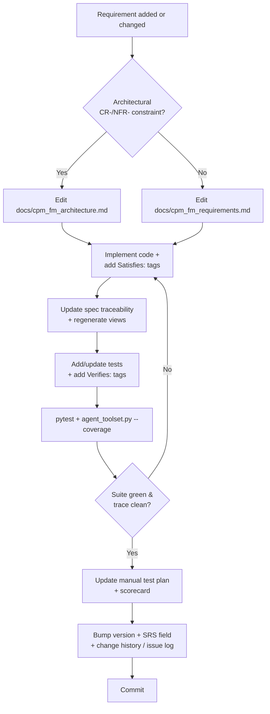
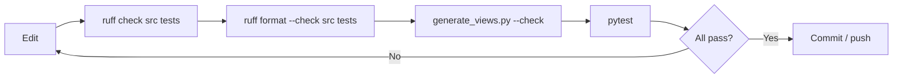
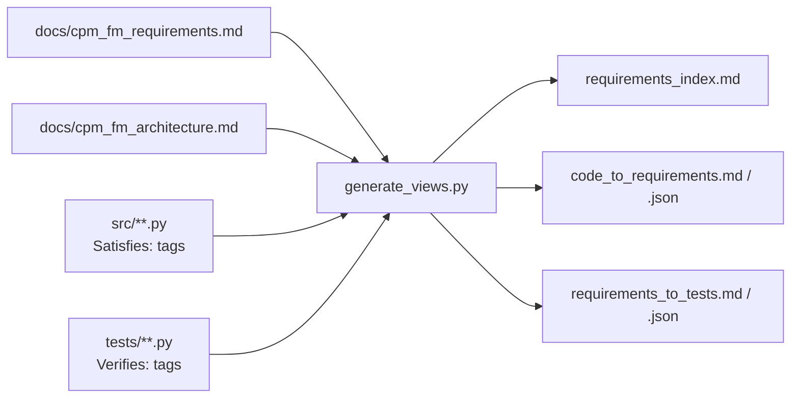
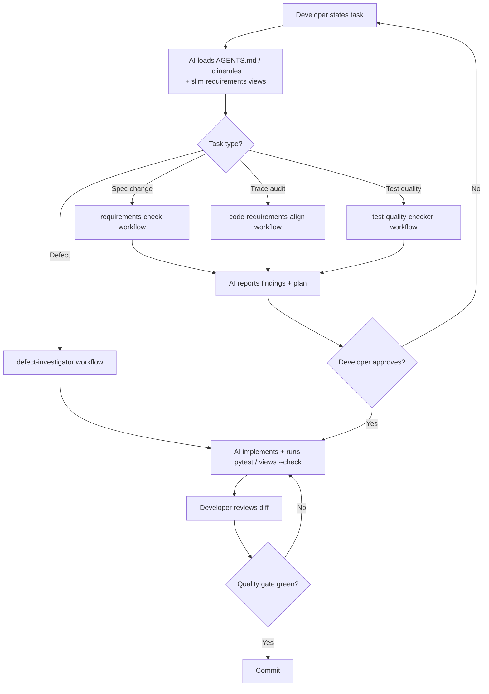
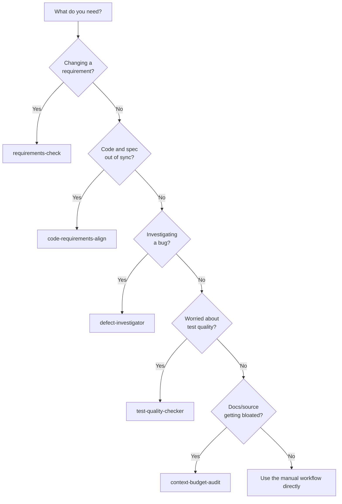
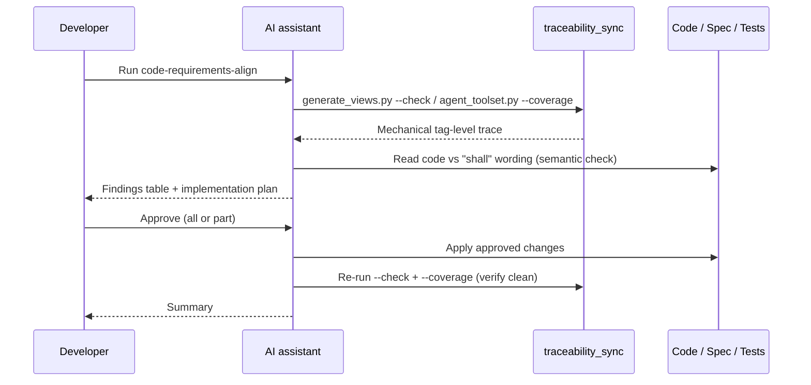

# CP/M File Manager (`cpm-fm`)

A cross-platform PySide6 desktop app for transferring files between a modern host and legacy
[CP/M](https://en.wikipedia.org/wiki/CP/M) systems over a serial link, using the X-Modem protocol.

## Features

- Browse host and remote (CP/M) file listings side by side, with a draggable splitter.
  Each pane has a wildcard/substring **filter** and a **sort** control (by name or
  extension, ascending or descending); the filter and sort are remembered per pane.
- Transfer single or multiple selected files in both directions over X-Modem, with a
  modal progress dialog (file name, block/byte counts, batch position) and a **Cancel**
  button to abort an in-progress transfer.
- **Drag and drop** to transfer: drag selected files between the panes, or drop files
  from the host OS file manager onto the Remote pane to upload them.
- **File-conflict handling:** when a file already exists at the destination you are
  prompted to Overwrite, Skip, or Cancel, with an option to apply the choice to the
  rest of the batch.
- **CP/M 8.3 filename validation** on upload: a host file whose name CP/M can't store
  prompts you to rename (with a suggested conforming name), skip, or cancel.
- **Transfer history:** every transfer attempt (success, failure, cancelled, or skipped)
  is recorded to a persistent history you can review, filter, export, clear, and
  re-transfer from (**History** toolbar button).
- **Whole-drive Backup and Restore** (toolbar buttons): mirror every file between the
  remote drive and the host directory in one operation. **Backup** copies the whole
  remote drive to the host; **Restore** copies the whole host directory to the remote
  drive. Each first refreshes the destination, then warns that **all** files at the
  destination will be deleted and re-written and asks you to continue or cancel; on
  confirmation it wipes the destination and copies the source across, with the usual
  progress dialog and a Cancel button.
- Manage files on both sides from a right-click context menu: transfer, rename, delete,
  and view/edit (host) or view (remote); transfer and delete act on every selected file.
- Built-in non-modal serial terminal for issuing CP/M commands, with a remote
  drive-selection drop-down (A:–P:).
- Separate terminal and transport serial ports (which may be the same physical port).
- Configurable serial parameters and CP/M commands via Serial and General config
  dialogs, saved/loaded as JSON.
- Remembers and auto-reloads the last-used configuration on startup, shows its name in
  the title bar, and persists each window's size and position between runs.
- Material Design theme that follows the host OS light/dark mode.
- Multi-language user interface (12 languages, selectable from **Config > Language**):
  English, Spanish, French, German, Italian, Dutch, Polish, Greek, Mandarin, Cantonese,
  Korean — and Pirate.
- **Help > Manual** opens the bundled user manual; **Help > About** shows the version
  and a link to the project repository.

## Requirements

- Python 3.9 or newer. (Continuous integration tests on Python 3.12; that is the
  reference interpreter for development.)
- A serial connection to the CP/M system.
- Runtime dependencies (installed automatically): `PySide6` (Qt GUI), `qt-material`
  (theme), `pyserial` (serial I/O), and `markdown` (renders the bundled user manual).

## Install

```bash
python -m pip install -e .[dev]
```

This installs the package in editable mode together with the development tools
(`pytest`, `ruff`, `mypy`, `pre-commit`, `Pillow`, `pydantic`). For the full
contributor setup — including the pre-commit hooks — see
[Developer Workflow](#developer-workflow).

## Run

```bash
cpm-fm           # via the installed GUI launcher (no console window on Windows)
python -m cpm_fm # equivalent, keeps a console for debugging output
```

The app starts unconfigured (unless it can reload the last-used configuration). Use
**File > Load** to load a settings file — see the samples in [`examples/`](examples/) — or set
parameters via the **Config** menu and **File > Save** them. **File > New** resets to defaults.
The loaded configuration's name is shown in the title bar.

Connect, disconnect, open the terminal, view the transfer history, and run a whole-drive **Backup**
or **Restore** from the toolbar. Right-click a file in either pane for transfer, rename, delete, and
view actions, or drag files between the panes to transfer them.

## Developer Workflow

This section is the single source of truth for building, testing, and — most
importantly — keeping the **requirements, code, tests, and documentation in sync**.
The project is requirements-driven: every behaviour traces to an identified
requirement, and that trace is mechanically enforced (a stale trace fails CI).

### One-time environment setup

```bash
python -m pip install -e .[dev]   # editable install + dev tools
pre-commit install                # install the local git hooks (see below)
```

The pre-commit hooks ([`.pre-commit-config.yaml`](.pre-commit-config.yaml)) mirror the
CI lint and trace-freshness gates so drift is caught before a push rather than failing
CI. They reuse the tools installed by `.[dev]`, so the hook versions always match the
project's pins. Run them by hand at any time with:

```bash
pre-commit run --all-files
```

### Build, test, and the quality gate

The inner development loop is four commands. CI runs all of them on Python 3.12
([`.github/workflows/ci.yml`](.github/workflows/ci.yml)); the pre-commit hooks run the
lint and trace-freshness checks locally.

```bash
pytest                                                   # full test suite (-q is set in pyproject.toml)
ruff check src tests                                     # lint
ruff format src tests                                    # format (CI uses --check; drop it to apply)
mypy src                                                 # type-check
python tools/traceability_sync/generate_views.py --check # fail if the generated views are stale
```

Useful narrower invocations:

```bash
pytest tests/test_cpm_parser.py                                            # one file
pytest tests/test_cpm_parser.py::test_parse_dir_output_extracts_filenames # one test
ruff format --check src tests                                              # verify formatting without editing
```

On Windows, prefer the array/sequential PowerShell forms documented in
[`.clinerules/tooling_notes.md`](.clinerules/tooling_notes.md) (e.g. activate the venv
and run pytest in a single chained call). For building a redistributable executable,
see [Building a standalone package](#building-a-standalone-package).

### Keeping requirements, code, tests, and docs in sync

The authoritative documents are:

- [`docs/cpm_fm_requirements.md`](docs/cpm_fm_requirements.md) — the **Software
  Requirements Specification** (ISO/IEC/IEEE 29148), source of truth for most
  requirements (`FR-`/`UIR-`/`DR-`/`STR-` and the behavioural `CR-`/`NFR-` plus the
  X-Modem `NFR-003*`).
- [`docs/cpm_fm_architecture.md`](docs/cpm_fm_architecture.md) — the **Software
  Architecture Description**, source of truth for the architectural constraints
  (`CR-001`–`CR-009`, `CR-012`–`CR-014`) and architectural NFRs (`NFR-001`, `NFR-004`,
  `NFR-005`). Edit these `CR-`/`NFR-` requirements here, not in the SRS.

Traceability is bidirectional and tag-based: each implementing function carries a
`Satisfies:` docstring tag citing requirement IDs, and each test carries a `Verifies:`
tag. The read-only views under [`docs/requirements_views/`](docs/requirements_views/) are
**generated** from the two specs plus those tags by
[`tools/traceability_sync/generate_views.py`](tools/traceability_sync/generate_views.py)
— never hand-edit them.

**When you add or change a requirement, follow every step in order** (this is the
mandatory workflow; see [`AGENTS.md`](AGENTS.md) for the agent-facing version):

1. **Edit the spec.** Add/modify the requirement in `docs/cpm_fm_requirements.md` — or,
   for an architectural `CR-`/`NFR-` constraint, in `docs/cpm_fm_architecture.md`.
2. **Implement the change.** In every new/changed function, add or update a `Satisfies:`
   docstring tag citing the requirement ID(s).
3. **Update the spec's traceability** mapping to the new/changed functions, then
   **regenerate the views**: `python tools/traceability_sync/generate_views.py` and
   commit `docs/requirements_views/`.
4. **Add/update tests** for the new behaviour, tagging each test docstring with a
   `Verifies:` line citing the requirement ID(s). Run `pytest`, then check coverage:
   `python tools/traceability_sync/agent_toolset.py --coverage` (lists requirements with
   no verifying test and any stale tags).
5. **Iterate steps 2–4** until the suite is green and the trace is clean
   (`generate_views.py --check` exits 0, no stale tags).
6. **Update the manual test plan** ([`docs/manual_test_plan.md`](docs/manual_test_plan.md))
   and bump its plan version.
7. **Update the manual test scorecard**
   ([`docs/manual_test_scorecard.md`](docs/manual_test_scorecard.md)) to match, bumping
   its score version.
8. **Record the change:** bump [`src/version.txt`](src/version.txt) and the SRS version
   field (DR-040/DR-041), add a row to
   [`docs/requirements_change_history.md`](docs/requirements_change_history.md), and — if
   a review resolved an ambiguity or gap — an entry in
   [`docs/requirements_issue_log.md`](docs/requirements_issue_log.md).

> The `agent_toolset.py` helper can also rewrite the spec's `Source:` cells to match the
> code's `Satisfies:` tags. It is report-only by default; preview with `--dry-run`, then
> write with `--apply`.

#### Requirement-change workflow



#### Local quality gate

Run before every push; the pre-commit hooks and CI enforce the same checks.



#### How the traceability views are produced



> **More diagrams:** the X-Modem protocol requirements (`NFR-003*`) are already
> illustrated with sequence diagrams (128-byte and 1K transfers) in
> [`docs/xmodem_specs.md`](docs/xmodem_specs.md) — reference that rather than duplicating
> it here. One worth *adding* as the project grows is a `graph` of the runtime layering
> (`gui/` → `terminal/` + `utils/`) showing the `CR-014` rule that `terminal/` and
> `utils/` import no GUI toolkit — a quick visual for the threading/decoupling model in
> [`docs/cpm_fm_architecture.md`](docs/cpm_fm_architecture.md).

## Developer Workflow (AI Assisted)

The repository is set up so AI coding assistants can do real work without loading the
whole (large) SRS into context, and so their changes stay traceable. The same build and
test commands from [Developer Workflow](#build-test-and-the-quality-gate) apply — the
assistant runs `pytest`, `generate_views.py --check`, `ruff`, and `mypy` exactly as a
human would; what differs is the context the tool is given and how the repo workflows are
invoked.

### What the AI reads

- [`AGENTS.md`](AGENTS.md) — the agent-facing project guide: commands, the architecture
  summary, the threading rules, and the mandatory requirement-change workflow.
- [`.clinerules/`](.clinerules/) — context-budget guidance
  (`requirements-context.md`: *use the slim generated views, don't read the whole spec*)
  and environment notes (`tooling_notes.md`).
- [`docs/requirements_views/`](docs/requirements_views/) — the slim, generated views the
  guidance points the AI at: `requirements_index.md` for broad understanding,
  `code_to_requirements.md` to find the IDs a file implements, and
  `requirements_to_tests.md` to check a requirement's test coverage.

> Everything an AI needs lives in these files — `AGENTS.md`, `.clinerules/`,
> `Workflows/`, and the views. This README is for humans and is **not** a context source
> for the AI tools; the AI-facing docs deliberately do not reference it.

### Claude Code vs Cline — the differences

Both assistants drive the same repo, but they discover context and run workflows
differently:

| Aspect | Claude Code | Cline |
|--------|-------------|-------|
| Auto-loaded project guide | [`AGENTS.md`](AGENTS.md) | [`.clinerules/`](.clinerules/) (`requirements-context.md`, `tooling_notes.md`) |
| Repo workflows in [`Workflows/`](Workflows/) | Point the assistant at the workflow file (or ask it to follow that workflow) | Invoked as slash-command workflows (e.g. `/requirements-check`) |
| Permissions / settings | [`.claude/settings.local.json`](.claude/settings.local.json) command allowlist | Cline's own auto-approve settings |
| Tool vocabulary | Built-in `Bash` / `Read` / `Edit` tools | Cline tools (`run_commands`, `read_files`, `search_codebase`, …) documented in [`tooling_notes.md`](.clinerules/tooling_notes.md) |

`AGENTS.md` and `.clinerules/requirements-context.md` are deliberately kept in agreement
on the shared facts (the `context-budget-audit` workflow checks this) — so the *guidance*
is the same regardless of which tool reads it; only the loading mechanism differs.

### The repo workflows

[`Workflows/`](Workflows/) holds five multi-agent workflow definitions. Each is a
read-and-report / plan-then-ask procedure — the requirement-touching ones **stop and ask
for explicit approval before changing anything**:

| Workflow | Use it to… |
|----------|-----------|
| [`requirements-check`](Workflows/requirements-check.md) | Review/edit requirements against ISO/IEC/IEEE 29148; the front door for any **spec** edit. |
| [`code-requirements-align`](Workflows/code-requirements-align.md) | Audit two-way traceability — find unimplemented requirements, orphan code, divergences, and untested requirements. |
| [`defect-investigator`](Workflows/defect-investigator.md) | Investigate a defect: reproduce, write a failing test, fix, verify. |
| [`test-quality-checker`](Workflows/test-quality-checker.md) | Adversarially audit test *quality* (not just coverage) and propose high-value tests. |
| [`context-budget-audit`](Workflows/context-budget-audit.md) | Periodic health check that docs/source stay small enough for small/local-LLM context windows. |

### The AI-assisted loop



#### Choosing a workflow



#### A `code-requirements-align` run



## Building a standalone package

Standalone executables are built with [PyInstaller](https://pyinstaller.org/):

```bash
python -m pip install -e .[build]   # adds PyInstaller
python build_dist.py                # builds for the current OS
```

Output lands in `dist/`: a single `cpm-fm.exe` on Windows, a single `cpm-fm`
binary on Linux, and `cpm-fm.app` on macOS.

PyInstaller **cannot cross-compile** — each package must be built on its own OS.
`build_dist.py` auto-selects the matching spec (`pyinstaller_windows.spec`,
`pyinstaller_linux.spec`, `pyinstaller_macos.spec`; shared settings live in
`_pyinstaller_common.py`). To produce all three, run it once on each platform —
the docstring at the bottom of `build_dist.py` includes a ready-to-use GitHub
Actions matrix that does exactly that. Optional app icons: drop
`assets/icon.ico` / `assets/icon.icns` / `assets/icon.png` into the repo.

## Project layout

```
src/cpm_fm/          application package (src-layout)
  app.py             MainWindow + main() entry point
  version.py         version/identity constants (reads src/version.txt)
  gui/               PySide6 dialogs, terminal window, theme, window-state persistence
  terminal/          serial manager, CP/M DIR parser, X-Modem protocol
  utils/             JSON config handling and runtime internationalisation (i18n)
  lang/              per-language UI string files (lang_<language>.txt)
  icons/             runtime window icon
  docs/              bundled user manual (cpm_fm_manual.md), shown by Help > Manual
tests/               pytest suite (each test tagged with Verifies: requirement IDs)
examples/            sample serial/general settings JSON
tools/               developer tooling, incl. traceability_sync/ (view generator,
                     coverage/trace helper)
Workflows/           AI multi-agent workflow definitions (see Developer Workflow (AI Assisted))
docs/                requirements (SRS) + architecture description, generated requirement
                     views, manual test plan/scorecard, change history, issue log, and
                     legacy design docs
AGENTS.md            agent-facing project guide
.clinerules/         Cline context-budget rules and environment notes
build_dist.py        PyInstaller driver; pyinstaller_*.spec + _pyinstaller_common.py
```

`docs/cpm_fm_requirements.md` (the SRS) and `docs/cpm_fm_architecture.md` (the
architecture description) are the authoritative, traceable specifications; everything
under `docs/requirements_views/` is generated from them. See
[Developer Workflow](#keeping-requirements-code-tests-and-docs-in-sync) for how they fit
together.

## License

Apache License 2.0 — see [LICENSE](LICENSE).
