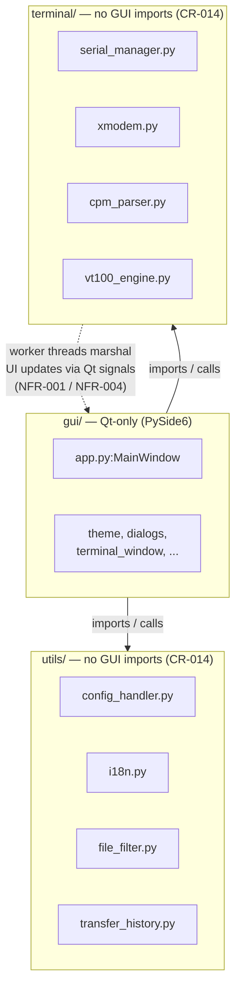

<!-- CONTEXT NOTE FOR LLMs: This is the architecture companion to the SRS
     (docs/cpm_fm_requirements.md). The narrative sections (A1–A3) describe the
     as-built design; the requirement tables (A4–A7) hold the architectural
     constraints (CR-/NFR-) extracted from the SRS. The CR/NFR rows here are
     indexed into docs/requirements_views/requirements_index.md alongside the
     SRS — consult that view for a terse overview before loading this file. -->

# CP/M File Manager — Software Architecture Description

| Field | Value |
|-------|-------|
| Document title | CP/M File Manager Software Architecture Description |
| Document ID | CPM-FM-ARCH |
| Version | Tracks the SRS (`docs/cpm_fm_requirements.md`) version field |
| Status | Reviewed |
| Standard | ISO/IEC/IEEE 42010:2011 (architecture description), companion to the ISO/IEC/IEEE 29148 SRS |
| Owner | Project maintainer |
| Source documents | `docs/legacy/App_Design.md` (archived); `docs/cpm_fm_requirements.md` §1.2/§1.3, §7, §8 |

This document is the **authoritative description of the software architecture and design** of
`cpm-fm`. It holds the architectural design constraints (the `CR-` requirements governing structure,
toolkit, and layering) and the architectural non-functional requirements (the `NFR-` requirements
governing concurrency and extensibility) that were previously carried in §7 and §8 of the SRS. The
SRS remains the single source of truth for *functional*, *interface*, *data*, and behavioural
requirements; the requirement IDs below are unchanged so all existing traceability and code
`Satisfies:` tags continue to resolve.

---

## A1. Architectural overview

`cpm-fm` is a cross-platform desktop GUI application, written in Python, that transfers files between a
modern host system and a legacy CP/M system over a serial (RS-232 style) communications link using the
X-Modem protocol (STR-001, STR-003, IFR-001). It presents a host file list and a remote file list side
by side, with controls to connect to the remote CP/M system, list remote files, and transfer single or
multiple files in both directions, plus host/remote file management (rename, delete, view) and
whole-drive Backup/Restore. A non-modal terminal window enables direct serial interaction with the
remote system, and the UI is internationalised across multiple languages.

As of v1.3 the GUI is implemented with **PySide6 (Qt for Python)** using a Material Design visual theme
(CR-012, CR-013); prior baselines used Tkinter, of which no code remains. The package uses a `src/`
layout under `src/cpm_fm/`. `app.py:MainWindow` (a `QMainWindow` subclass) is the hub that owns all
components and wires UI events to them; `app.py:main` creates the `QApplication`, applies the theme,
shows the window, and runs `app.exec()` — it is the entry point for both the `cpm-fm` launcher and
`python -m cpm_fm` (CR-002).

## A2. Layered structure

The application is organised into three layers, intentionally decoupled from the GUI so the non-GUI
layers are unit-testable without a running Qt application. **CR-014** forbids PySide6 (or any other
GUI-toolkit) imports in `terminal/` and `utils/`.

The arrows are deliberately one-directional: `gui/` depends on `terminal/` and `utils/`, never the
reverse. The dashed edge is not an import — it is the runtime threading path, where background daemon
threads in `terminal/` (serial reads, X-Modem transfers) push results back to the GUI thread by
**emitting Qt signals** rather than touching widgets directly (see A3, NFR-001/NFR-004).

- **`terminal/` — serial, transfer, and parsing (no GUI):**
  - `serial_manager.py` — `SerialManager` owns two `pyserial` ports: a **terminal** port (for CP/M
    commands) and a **transport** port (for X-Modem transfers); they may map to the same physical port
    (IFR-002). A background daemon thread (`_read_loop`) polls the terminal port and pushes received
    text to the `on_data_received` callback.
  - `xmodem.py` — `XModem` is a hand-rolled X-Modem implementation (128-byte SOH-framed packets by
    default, with selectable XMODEM-1K 1024-byte STX framing; both checksum and CRC error-check modes
    selected by the receiver-driven handshake — see NFR-003a–NFR-003o). `send_file`/`receive_file` are blocking
    and run on worker threads.
  - `cpm_parser.py` — `CPMParser.parse_dir_output` is a pure static method that scrapes filenames from
    CP/M 2.2 four-column `DIR` output (DR-001–DR-033); the most-tested logic in the codebase.
  - `vt100_engine.py` — `VT100Engine` is a thin, GUI-free wrapper over the `pyte` VT-100/ANSI screen
    emulator (a pure-Python runtime dependency, no GUI imports, so CR-014 holds). It is fed raw received
    bytes and exposes the screen grid, cursor, per-cell attributes, dirty lines, and scrollback for the
    `gui/terminal_view.py` renderer (FR-091/FR-157). The receive path decodes bytes for the receive/
    capture buffers on the daemon thread but feeds the engine only on the GUI thread (via `term_write`),
    keeping the emulator single-threaded (NFR-001/NFR-004).
- **`utils/` — GUI-free support (no GUI):**
  - `config_handler.py` — `ConfigHandler` loads/saves settings as JSON (IFR-004) and normalises the two
    config shapes (NFR-002).
  - `i18n.py` — process-wide internationalisation singleton: `tr(key, ...)` resolves a placeholder key
    to text in the active language, `set_language` switches it. Strings live in
    `lang/lang_<language>.txt`; `lang_english.txt` is the complete reference/fallback (FR-121, FR-124,
    DR-042/043). The translator observes CR-014 (no GUI imports).
  - `file_filter.py` — pure wildcard/substring filtering and sorting used by both file panes.
  - `transfer_history.py` — `TransferHistory`, a GUI-free, thread-safe JSON persistence layer (default
    `~/.cpm_fm_history.json`) recording one entry per transfer *attempt* with retention pruning
    (FR-140–FR-142, DR-045).
- **`gui/` — Qt-only widgets and dialogs:** `theme.py` (`apply_theme`, the central `qt-material`
  setup), `terminal_window.py` (non-modal serial console), `config_dialogs.py` (`ConfigDialog` base +
  `SerialConfigDialog`/`GeneralConfigDialog`, built from declarative field lists), `file_list_widget.py`
  (per-pane drag-and-drop list), `transfer_dialog.py`, `conflict_dialog.py`,
  `filename_validation_dialog.py`, `transfer_history_dialog.py`, `manual_dialog.py`,
  `file_action_dialog.py`, `about_dialog.py`, `dialog_buttons.py` (shared helpers), and
  `window_state.py` (`WindowState`: QSettings-backed window geometry + last-used config dir/file).

## A3. Cross-cutting behaviours

- **Threading model (NFR-001, NFR-004):** Serial reads and both transfer directions run off the Qt GUI
  thread on daemon threads. Any UI update from those threads must be marshalled onto the GUI thread by
  **emitting a Qt signal** connected with `Qt.QueuedConnection` (or the implicitly-queued cross-thread
  default) — never touch a widget directly from a worker thread. `MainWindow` declares these signals at
  the top of the class; most push status/progress to the UI, while three —
  `conflict_detected`, `invalid_name_detected`, `backup_restore_confirm` — drive a **modal prompt on
  the GUI thread while the worker thread blocks** awaiting the user's decision. New background work must
  follow this signal pattern.
- **Remote file listing is capture-based, not request/response:** `_capture_terminal_response` sets a
  `_capture_active` flag, sends the command, waits for output to begin accumulating in
  `_remote_capture_buffer` via the read callback, then polls until the buffer stops growing within an
  idle window (bounded total wait). `_do_refresh_remote_logic` calls this for the `DIR` command and
  then parses the captured text.
- **Two config JSON formats coexist (NFR-002)** and both must keep working: a *flat* shape (what the
  dialogs read/write; every file in `examples/`) and a *nested* `{"serial": {...}, "general": {...}}`
  shape with variant key names. `SerialManager.open_port` and `ConfigHandler.validate_serial_settings`
  defensively normalise both.
- **Three separate persistence stores, deliberately not merged:** the per-configuration serial/general
  JSON (`ConfigHandler`), the QSettings-backed UI/session state (`WindowState` — window geometry,
  last-used config dir/file), and the transfer-history JSON (`TransferHistory`). Keep them distinct.
- **The app starts unconfigured** (`self.settings = {}`, FR-003); settings come from File > Load, the
  Config dialogs, or the automatic reload of the last-used configuration file.
- **GUI strings are never hard-coded (CR-015):** every user-facing string is routed through
  `i18n.tr(key)`, with the key added to all `lang/lang_*.txt` files; protocol/command values are not
  translated.

---

## A4. Project structure and module organisation

| ID | Requirement | Priority | Verification | Source |
|----|-------------|----------|--------------|--------|
| CR-001 | All source files shall reside under a `src` folder at the project root. | Mandatory | I | App_Design §Project Structure |
| CR-002 | The package shall provide a runnable module entry point at `src/cpm_fm/__main__.py` that invokes `cpm_fm.app:main()`, enabling `python -m cpm_fm`. | Mandatory | I | App_Design §Project Structure; impl. `app.py:main` |
| CR-003 | All GUI-related source files shall reside in a `gui` folder within the source tree. | Mandatory | I | App_Design §Project Structure |
| CR-004 | All serial and terminal related source files shall reside in a `terminal` folder within the source tree. | Mandatory | I | App_Design §Project Structure |
| CR-005 | All other source files shall reside in a `utils` folder within the source tree. | Mandatory | I | App_Design §Project Structure |
| CR-006 | Non-Python assets (icons, images) shall be kept out of the Python source modules. *(v2.5: non-Python assets now exist and are organised as follows, superseding the deferred-`resources/` note carried since OI-16: the single source artwork lives at `src/icons/cpm-fm-2.png`; the generated per-platform packaging icons live under `assets/` at the project root — `assets/icon.ico`/`.icns`/`.png` and the freedesktop `assets/icons/hicolor/` tree — and are optional inputs to the PyInstaller builds; the runtime window icon ships as package data at `src/cpm_fm/icons/cpm-fm.png`, DR-044. `tools/make_icons.py` regenerates them all from the source artwork.)* | Desirable | I | App_Design §Project Structure; v2.5 application icon |
| CR-007 | Source files shall be organised as cohesive modules, one module per logical component (serial management, X-Modem, parser, configuration, each GUI window/dialog family). A module may contain more than one closely related class (e.g. `gui/config_dialogs.py` holds `ConfigDialog` and its subclasses), and a single large component may conversely be composed from several cooperating modules (e.g. the main window is assembled from the mixin modules `gui/mw_*.py`). | Mandatory | I | App_Design §Class Files (relaxed in v1.2 to as-built) |
| CR-008 | Source files shall be named in `snake_case` after the component they implement (e.g. `serial_manager.py`, `cpm_parser.py`), not necessarily identically to a contained class name. | Mandatory | I | App_Design §Class Files (relaxed in v1.2 to as-built) |
| CR-009 | All Python source files shall adhere to the PEP 8 standard. | Mandatory | T | App_Design §Code Quality |

## A5. GUI toolkit and visual theme

| ID | Requirement | Priority | Verification | Source |
|----|-------------|----------|--------------|--------|
| CR-012 | The graphical user interface shall be implemented with **PySide6 (Qt for Python)**. Tkinter shall not be used for any GUI component. PySide6 shall be declared as a runtime dependency in `pyproject.toml`. | Mandatory | I | v1.3 UI migration; impl. `app.py:main`, `pyproject.toml` |
| CR-013 | The Material Design visual theme (UIR-070) shall be supplied by the `qt-material` package, declared as a runtime dependency in `pyproject.toml`. The theme shall be applied centrally at application start-up (not per-widget), so that all current and future windows inherit it. | Mandatory | I | v1.3 UI migration; impl. `app.py:main`, `theme.py:apply_theme` |

## A6. Layer decoupling

| ID | Requirement | Priority | Verification | Source |
|----|-------------|----------|--------------|--------|
| CR-014 | The GUI, serial/terminal (`terminal/`), and configuration (`utils/`) layers shall remain decoupled such that the `terminal/` and `utils/` modules contain no PySide6 (or other GUI-toolkit) imports and remain unit-testable without a running Qt application. The runtime translator (`utils/i18n.py`, FR-121) shall observe this constraint. | Mandatory | T | AGENTS.md §Architecture; v1.3 UI migration; impl. `utils/i18n.py`, `utils/file_filter.py`, `utils/transfer_history.py`, `terminal/vt100_engine.py:Cell`, `terminal/vt100_engine.py:VT100Engine` |

## A7. Concurrency and extensibility

| ID | Requirement | Priority | Verification | Source |
|----|-------------|----------|--------------|--------|
| NFR-001 | The application shall remain responsive during serial reads and file transfers. The threading model that achieves this is specified by NFR-001a–NFR-001c. *(Prior to v1.3 the cross-thread marshalling was performed with Tkinter's `self.after(0, ...)`.)* | Mandatory | T | impl. `serial_manager.py:_read_loop`, `mw_transfer_batches.py` transfer threads; v1.3 UI migration; tests `test_serial_manager.py` (read-loop dispatch & pause/resume) |
| NFR-001a | Serial reads shall run on a background daemon thread. | Mandatory | T | — |
| NFR-001b | Each file transfer shall run on its own background thread. | Mandatory | T | — |
| NFR-001c | All GUI updates originating from those threads shall be marshalled onto the Qt GUI (main) thread via the Qt signal/slot mechanism (queued connections) — see NFR-004. | Mandatory | T | — |
| NFR-004 | No Qt widget shall be created or mutated from any thread other than the Qt GUI (main) thread. Cross-thread UI updates (serial receive callbacks, transfer progress/results, transfer byte echo) shall be delivered to the GUI thread exclusively via Qt signals connected with `Qt.QueuedConnection` (or the implicitly-queued cross-thread default), satisfying NFR-001. | Mandatory | T | v1.3 UI migration; impl. `app.py:_connect_signals` |
| NFR-005 | Adding support for a new language shall require only adding a `lang_<language>.txt` file (DR-042) to the `lang/` folder; no source-code change shall be necessary for the new language to be discovered, listed in the Language menu (FR-122/UIR-077), and selectable. | Desirable | T | impl. `utils/i18n.py:available_languages`, `app.py:_setup_language_menu` |
