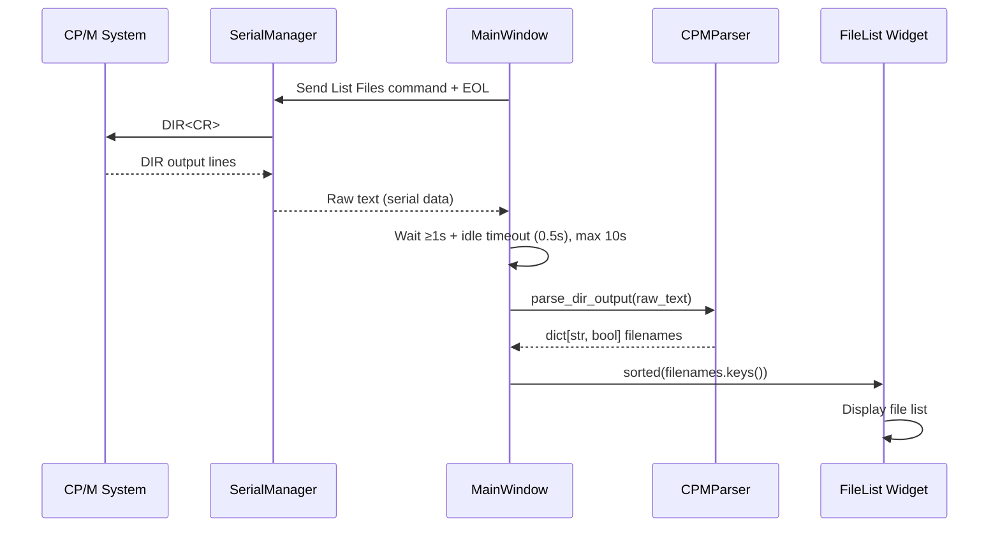
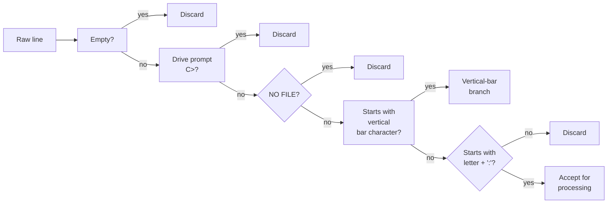
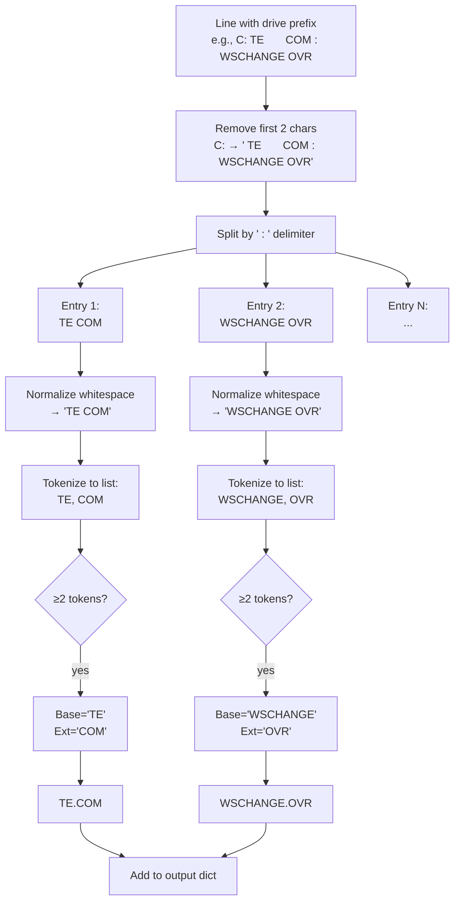
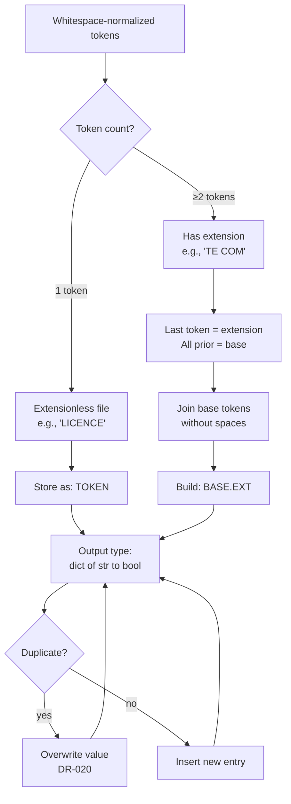
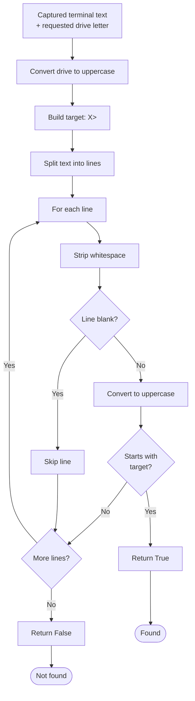
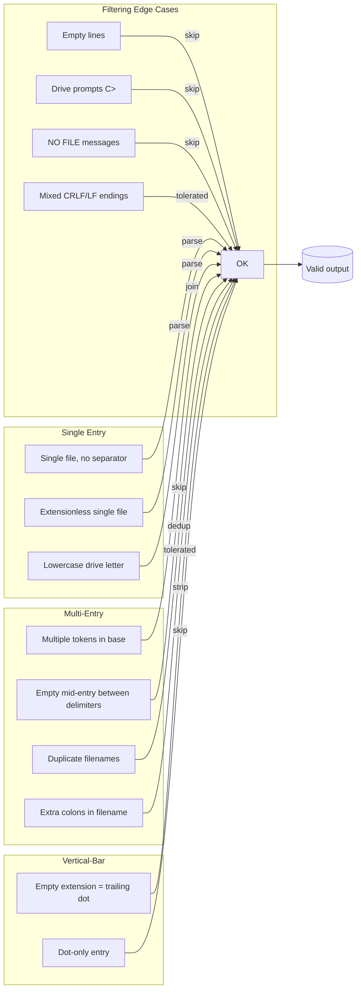
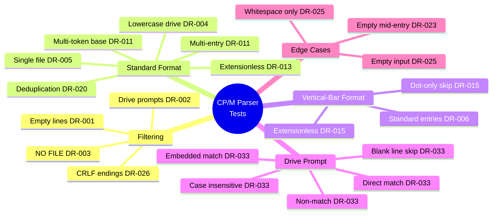

# CP/M DIR Parser — Technical Documentation

## Table of Contents
1. [Overview](#1-overview)
2. [Architecture Integration](#2-architecture-integration)
3. [Parsing Algorithm](#3-parsing-algorithm)
4. [Supported Input Formats](#4-supported-input-formats)
5. [Drive Prompt Detection](#5-drive-prompt-detection)
6. [Public API](#6-public-api)
7. [Edge Cases & Robustness](#7-edge-cases--robustness)
8. [Requirements Traceability](#8-requirements-traceability)
9. [Test Coverage](#9-test-coverage)

---

## 1. Overview

### 1.1 Purpose

The CP/M DIR Parser is a component of the CP/M File Manager (`cpm-fm`) application that extracts file names from the raw text output of a legacy CP/M 2.2 `DIR` command executed over a serial connection. The parser translates CP/M's distinctive 4-column, space-padded, 8.3-format directory listings into a clean, structured dictionary of canonical filenames suitable for display in a modern host GUI.

### 1.2 Key Characteristics

- **Protocol-agnostic**: Operates purely on text; no serial or network dependencies
- **Dual-format support**: Handles both standard CP/M 2.2 output and ZCPR/ZSDOS vertical-bar format
- **Robust**: Tolerates irregular spacing, mixed line endings, extra colons, and empty entries
- **Lossless**: Preserves original case of filenames and extensions exactly as received

### 1.3 File Location

| Item | Path |
|------|------|
| Implementation | `src/cpm_fm/terminal/cpm_parser.py` |
| Test Suite | `tests/test_cpm_parser.py` |
| Requirements | `docs/cpm_fm_requirements.md` (Section 6, DR-001–DR-041) |

---

## 2. Architecture Integration

The parser sits in the data-processing layer between the serial terminal and the GUI display. Here is how data flows through the system:



The parser is invoked during two key user actions:

1. **Drive selection** — After changing the remote drive, the parser checks for a drive prompt via `has_drive_prompt()` and then parses the listing
2. **Remote file list refresh** — After sending the List Files command, the parser extracts all filenames from the captured response

---

## 3. Parsing Algorithm

### 3.1 High-Level Flow

The parser processes each line of raw CP/M output through a series of filters, then extracts file entries from the remaining lines. Here is the complete decision flow:

```mermaid
flowchart TD
    Start([Start: parse_dir_output text]) --> Split[Split text into lines]
    Split --> ForEach[For each line]
    ForEach --> Strip[Strip whitespace]
    Strip --> Empty{Line empty<br/>or whitespace?}
    Empty -->|Yes| Skip1[Skip line<br/>DR-001]
    Empty -->|No| PromptCheck
    
    PromptCheck{Line matches<br/>drive prompt<br/>C> pattern?}
    PromptCheck -->|Yes| Skip2[Skip line<br/>DR-002]
    PromptCheck -->|No| NoFileCheck
    
    NoFileCheck{"NO FILE"<br/>in line?}
    NoFileCheck -->|Yes| Skip3[Skip line<br/>DR-003]
    NoFileCheck -->|No| VBarCheck
    
    VBarCheck{Line starts<br/>with vertical<br/>bar character?}
    VBarCheck -->|Yes| VBarProcess[Process as<br/>ZCPR/ZSDOS<br/>vertical-bar format]
    VBarProcess --> VBarSplit[Split by '|']
    VBarSplit --> VBarNormalize[Remove all internal<br/>whitespace]
    VBarNormalize --> VBarJoin[Strip trailing dot<br/>if extensionless]
    VBarJoin --> VBarStore[Store in dict<br/>DR-015]
    VBarStore --> ForEach
    
    VBarCheck -->|No| DPrefixCheck
    DPrefixCheck{Line starts<br/>with drive<br/>prefix C:?}
    DPrefixCheck -->|No| Skip4[Skip line<br/>DR-004]
    DPrefixCheck -->|Yes| StripDrive[Strip drive<br/>identifier]
    StripDrive --> SplitEntries[Split by ' : '<br/>DR-011]
    SplitEntries --> ForEachEntry[For each entry]
    ForEachEntry --> Normalize["Normalize whitespace<br/>(merge spaces)<br/>DR-012"]
    Normalize --> Tokens[Split into<br/>tokens by space]
    Tokens --> TokenCount{Number<br/>of tokens?}
    TokenCount -->|0| Skip5[Skip empty<br/>entry DR-023]
    TokenCount -->|1| ExtLess[Extensionless<br/>filename<br/>DR-013]
    TokenCount -->|≥2| WithExt[Multi-token:<br/>base + ext]
    ExtLess --> StoreExtLess[Store as-is,<br/>no trailing dot]
    WithExt --> JoinBase[Join base tokens<br/>without spaces]
    JoinBase --> BuildName[Build NAME.EXT]
    BuildName --> StoreExt[Store in dict<br/>DR-014]
    StoreExt --> ForEach
    StoreExtLess --> ForEach
    Skip1 --> ForEach
    Skip2 --> ForEach
    Skip3 --> ForEach
    Skip4 --> ForEach
    Skip5 --> ForEach
    ForEach --> End{More lines?}
    End -->|Yes| ForEach
    End -->|No| Return([Return dict<br/>DR-021])
```

### 3.2 Phase 1: Line Filtering (DR-001 to DR-006)

Every input line passes through the following filter pipeline. A line that fails any filter is discarded:

| Step | Requirement | Rule | Rationale |
|------|-------------|------|-----------|
| 1 | DR-001 | Skip empty / whitespace-only lines | Blank lines carry no file data |
| 2 | DR-002 | Skip lines matching `C>` (drive prompt) | Shell prompts are not file entries |
| 3 | DR-003 | Skip lines containing "NO FILE" | Status messages, not listings |
| 4 | DR-006 | Check for vertical-bar format `\|` | ZCPR/ZSDOS variant — branch to separate processing |
| 5 | DR-004 | Check for drive prefix `C:` | Must be a file listing line |
| 6 | DR-005 | Process regardless of ` : ` separator presence | Single-file directories have no separator |

**Filter Pipeline Diagram:**



### 3.3 Phase 2: Entry Extraction (DR-010 to DR-015)

Once a line passes filtering, it enters the extraction phase:



### 3.4 Filename Construction Rules



---

## 4. Supported Input Formats

### 4.1 Standard CP/M 2.2 Format (DR-004, DR-005, DR-010–DR-014)

This is the canonical output from the CP/M 2.2 Control Program Processor (CCP).

**Format:** `<drive>: <field1> <field2> : <field3> <field4> ...`

- Drive letter followed by colon (e.g., `C:`)
- Fields are space-padded to 8 characters (filename) + 3 characters (extension)
- Multiple entries on one line are separated by ` : ` (space-colon-space)
- Extensionless files appear as a single token (no extension field)

**Example Input:**
```
C: TE       COM : WSCHANGE OVR : MYFILE   TXT
C: MOREFILES TXT : OTHER    BIN
C: LICENCE      
A: NO FILE FOUND
```

**Parsed Output:**
```python
{
    "TE.COM": True,
    "WSCHANGE.OVR": True,
    "MYFILE.TXT": True,
    "MOREFILES.TXT": True,
    "OTHER.BIN": True,
    "LICENCE": True
}
```

### 4.2 ZCPR/ZSDOS Vertical-Bar Format (DR-006, DR-015)

Used by CP/M variants with the ZCPR extension (Z80 CP/M Replacement), including ZSDOS.

**Format:** `| <filename> .<ext> | <filename> .<ext> | ...`

- No drive prefix
- Each entry starts with `|` (vertical bar)
- Dot between filename and extension is literal in the output
- Internal whitespace (space-padding) is removed

**Example Input:**
```
  |  ASM     .COM  |  CLRDIR  .COM  |  COMPARE .COM
  |  FILEATTR.COM  |  CPM     .SYS
```

**Parsed Output:**
```python
{
    "ASM.COM": True,
    "CLRDIR.COM": True,
    "COMPARE.COM": True,
    "FILEATTR.COM": True,
    "CPM.SYS": True
}
```

---

## 5. Drive Prompt Detection

### 5.1 Purpose

After changing the remote CP/M drive (e.g., typing `B:`), the system responds with a drive prompt (`B>`). The `has_drive_prompt()` method confirms the drive change succeeded before proceeding with file listing.

### 5.2 Detection Flow



### 5.3 Key Behaviors

| Requirement | Behavior |
|-------------|----------|
| DR-033 | Case-insensitive matching for both prompt and drive letter |
| FR-101 | Blank lines are ignored |
| FR-102 | Returns `True` if `X>` appears on any non-blank line |
| FR-103 | Returns `False` if no matching prompt found |

**Example:**
```python
# All of these return True for has_drive_prompt(text, "B"):
has_drive_prompt("B>", "B")                  # direct match
has_drive_prompt("B:\nB: SOMEFILE COM\nB>\n", "B")  # embedded in output
has_drive_prompt("b>", "B")                  # case-insensitive
has_drive_prompt("B>", "b")                  # case-insensitive
```

---

## 6. Public API

### 6.1 `parse_dir_output(text: str) -> dict[str, bool]`

Extracts file names from raw CP/M DIR output text.

**Parameters:**
| Name | Type | Description |
|------|------|-------------|
| `text` | `str` | Raw text output from a CP/M `DIR` command |

**Returns:**
| Type | Description |
|------|-------------|
| `dict[str, bool]` | Dictionary with canonical filenames as keys and `True` as values. Duplicate filenames overwrite existing entries. Returns empty dict if no valid entries found. |

**Guarantees:**
- No exceptions raised for invalid input (DR-024)
- Empty or whitespace-only input returns `{}` (DR-025)
- Case of filename/extension preserved exactly as received (DR-022)
- Tolerates irregular spacing, extra colons, mixed line endings (DR-026)

### 6.2 `has_drive_prompt(text: str, drive: str) -> bool`

Checks whether a CP/M drive prompt for the specified drive appears in captured terminal text.

**Parameters:**
| Name | Type | Description |
|------|------|-------------|
| `text` | `str` | Captured terminal output |
| `drive` | `str` | Drive letter to check (case-insensitive) |

**Returns:**
| Type | Description |
|------|-------------|
| `bool` | `True` if a non-blank line starts with `<drive>>`, `False` otherwise |

---

## 7. Edge Cases & Robustness

### 7.1 Handled Edge Cases



### 7.2 Unimplemented Features (DR-030–DR-032)

The parser makes explicit design decisions to NOT support:

| Requirement | Exclusion | Rationale |
|-------------|-----------|-----------|
| DR-031 | Long filenames | CP/M 2.2 uses 8.3 format only |
| DR-031 | Non-ASCII characters | Assumed ASCII input |
| DR-032 | File sizes, dates, attributes | Only names and extensions extracted |

---

## 8. Requirements Traceability

### 8.1 Line-Level Mapping

| Requirement | Implementation Line | Test Case |
|-------------|---------------------|-----------|
| DR-001 | Line 23–25 | `test_parse_dir_output_includes_extensionless_files` |
| DR-002 | Lines 28–29 | `test_parse_dir_output_ignores_prompts_and_empty` |
| DR-003 | Lines 32–33 | `test_parse_dir_output_ignores_prompts_and_empty` |
| DR-004 | Lines 59–60 | `test_parse_dir_output_accepts_lowercase_drive_letter` |
| DR-005 | Line 67 (split always) | `test_parse_dir_output_single_file_has_no_separator` |
| DR-006 | Lines 40–52 | `test_parse_dir_output_vertical_bar_format` |
| DR-010 | Line 63 | All standard tests |
| DR-011 | Lines 67, 72 | `test_parse_dir_output_skips_empty_entry_between_delimiters` |
| DR-012 | Line 72 | All standard tests |
| DR-013 | Lines 83–88 | `test_parse_dir_output_includes_extensionless_files` |
| DR-014 | Line 95 | All standard tests |
| DR-015 | Lines 43–48 | `test_parse_dir_output_vertical_bar_extensionless` |
| DR-020 | Line 98 | `test_parse_dir_output_deduplicates_repeated_names` |
| DR-021 | Line 100 | All standard tests |
| DR-022 | Line 95 (literal) | `test_parse_dir_output_extracts_filenames` |
| DR-023 | Lines 73–74, 83–88 | `test_parse_dir_output_includes_extensionless_files` |
| DR-024 | try/implicit | All edge-case tests |
| DR-025 | Line 18, 100 | `test_parse_dir_output_empty_input_yields_no_files` |
| DR-026 | Lines 72, 67 | `test_parse_dir_output_joins_multi_token_base` |
| DR-033 | Lines 103–120 | `test_has_drive_prompt_*` (all) |

### 8.2 Functional Requirements

| Requirement | Integration Point |
|-------------|-------------------|
| FR-077 | `app.py:_do_refresh_remote_logic` |
| FR-101 | `app.py:_capture_terminal_response` |
| FR-102 | `app.py:_do_change_drive_logic` |

---

## 9. Test Coverage

### 9.1 Test Suite Summary

The test suite (`tests/test_cpm_parser.py`) contains **18 test functions** covering:

| Test Function | Requirement(s) | What It Verifies |
|---------------|----------------|------------------|
| `test_parse_dir_output_extracts_filenames` | DR-004, DR-010–DR-014 | Standard multi-entry, multi-line parsing |
| `test_parse_dir_output_ignores_prompts_and_empty` | DR-001, DR-002, DR-003 | Filtering of prompts and empty lines |
| `test_parse_dir_output_includes_extensionless_files` | DR-013, DR-023 | Extensionless filename handling |
| `test_parse_dir_output_single_file_has_no_separator` | DR-005 | Single-file directory (no ` : `) |
| `test_parse_dir_output_single_extensionless_file` | DR-013, DR-021 | Extensionless + single file combined |
| `test_parse_dir_output_vertical_bar_format` | DR-006, DR-015 | ZCPR/ZSDOS format support |
| `test_parse_dir_output_vertical_bar_extensionless` | DR-015 | Trailing dot stripping in bar format |
| `test_has_drive_prompt_detects_prompt` | DR-033, FR-102 | Direct prompt detection |
| `test_has_drive_prompt_detects_prompt_embedded_in_output` | DR-033 | Prompt within larger output |
| `test_has_drive_prompt_matches_lowercase_response` | DR-033 | Case-insensitive prompt matching |
| `test_has_drive_prompt_matches_lowercase_request` | DR-033 | Case-insensitive drive parameter |
| `test_has_drive_prompt_ignores_blank_lines` | DR-033, FR-101 | Blank line handling |
| `test_has_drive_prompt_rejects_different_drive` | DR-033 | Non-matching drive letter |
| `test_parse_dir_output_joins_multi_token_base` | DR-011 | Multi-token base joining |
| `test_parse_dir_output_accepts_lowercase_drive_letter` | DR-004 | Lowercase drive acceptance |
| `test_parse_dir_output_skips_empty_entry_between_delimiters` | DR-023 | Empty mid-entry handling |
| `test_parse_dir_output_bar_format_skips_dot_only_entry` | DR-015 | Dot-only bar entry |
| `test_parse_dir_output_deduplicates_repeated_names` | DR-020 | Deduplication |
| `test_parse_dir_output_handles_crlf_line_endings` | DR-026 | CRLF tolerance |
| `test_parse_dir_output_empty_input_yields_no_files` | DR-025 | Empty/whitespace input |

### 9.2 Coverage Matrix



---

## Appendix A: CP/M 8.3 Filename Format Reference

CP/M 2.2 uses an 8.3 filename format where:

| Field | Width | Description |
|-------|-------|-------------|
| Filename | 8 chars | Space-padded, uppercase letters, digits, `$`, `_`, `@`, `?`, `#` |
| Extension separator | 1 char | Implicit (position-based, not a character) |
| Extension | 3 chars | Space-padded, same character set as filename |

Example layout in DIR output:
```
Position:  0123456789012345678901234567
           TE       COM : WSCHANGE OVR
           ^^^^^^^^ ^^^   ^^^^^^^^ ^^^
           filename ext    filename ext
```

This is why the parser relies on fixed-width field positions and space-normalization rather than delimiter-based parsing.