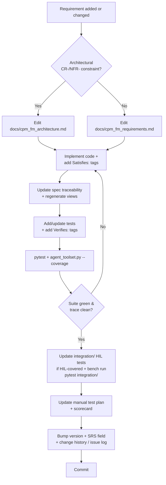
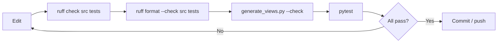
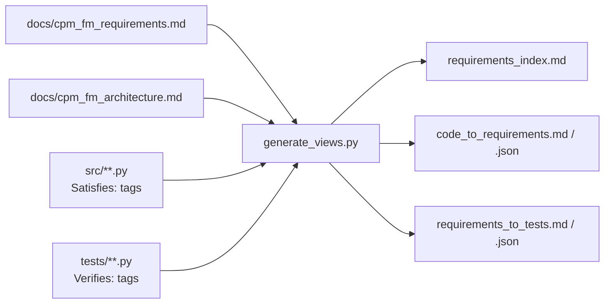
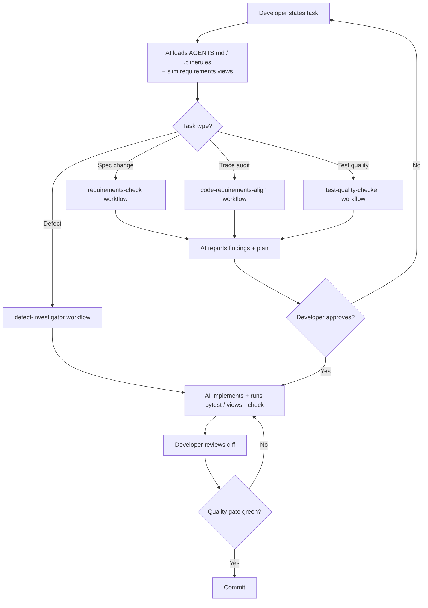
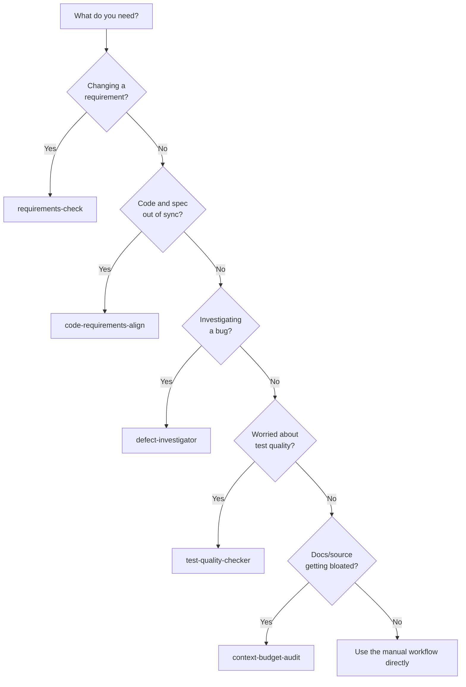
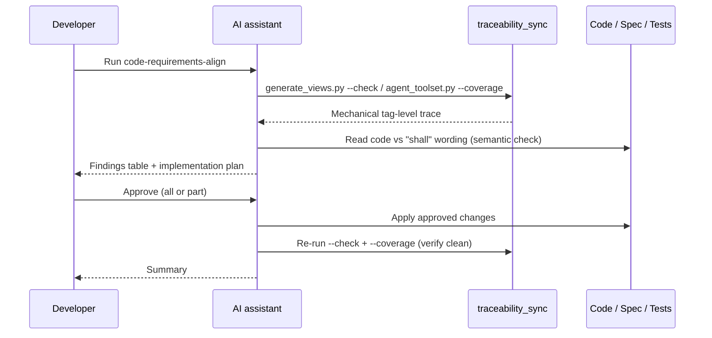

# Developer Guideline

## Developer Workflow

This section is the single source of truth for building, testing, and — most
importantly — keeping the **requirements, code, tests, and documentation in sync**.
The project is requirements-driven: every behaviour traces to an identified
requirement, and that trace is mechanically enforced (a stale trace fails CI).

### One-time environment setup

```bash
python -m pip install -e .[dev]   # editable install + dev tools
pre-commit install                # install the local git hooks (see below)
```

The pre-commit hooks ([`.pre-commit-config.yaml`](.pre-commit-config.yaml)) mirror the
CI lint and trace-freshness gates so drift is caught before a push rather than failing
CI. They reuse the tools installed by `.[dev]`, so the hook versions always match the
project's pins. Run them by hand at any time with:

```bash
pre-commit run --all-files
```

### Build, test, and the quality gate

The inner development loop is four commands. CI runs all of them on Python 3.12
([`.github/workflows/ci.yml`](.github/workflows/ci.yml)); the pre-commit hooks run the
lint and trace-freshness checks locally.

```bash
pytest                                                   # full test suite (-q is set in pyproject.toml)
ruff check src tests                                     # lint
ruff format src tests                                    # format (CI uses --check; drop it to apply)
mypy src                                                 # type-check
python tools/traceability_sync/generate_views.py --check # fail if the generated views are stale
```

Useful narrower invocations:

```bash
pytest tests/test_cpm_parser.py                                            # one file
pytest tests/test_cpm_parser.py::test_parse_dir_output_extracts_filenames # one test
ruff format --check src tests                                              # verify formatting without editing
```

On Windows, prefer the array/sequential PowerShell forms documented in
[`.clinerules/tooling_notes.md`](.clinerules/tooling_notes.md) (e.g. activate the venv
and run pytest in a single chained call). For building a redistributable executable,
see [Building a standalone package](#building-a-standalone-package).

#### Integration (hardware-in-the-loop) suite

The [`integration/`](integration/) suite drives the **real** app against a **real CP/M
machine** over serial — X-Modem protocol round-trips, the GUI over real serial, and
widget-tree look-and-feel assertions. It is **bench-only**: not run by CI or the default
`pytest` (the root run's `testpaths` is `tests/`), and it needs a configured target
(`integration/hil_config.json`, gitignored). Run it explicitly when hardware is connected:

```bash
pytest integration/                    # default target; --target / --all-targets pick rigs
pytest integration/ --run-destructive  # also the backup/restore (whole-drive-wipe) cases
python integration/run.py              # interactive target picker
```

See [`integration/README.md`](integration/README.md) for wiring, target setup, and the
manual-vs-automated split. It is additive test infrastructure and defines no requirements.

### Keeping requirements, code, tests, and docs in sync

The authoritative documents are:

- [`docs/cpm_fm_requirements.md`](docs/cpm_fm_requirements.md) — the **Software
  Requirements Specification** (ISO/IEC/IEEE 29148), source of truth for most
  requirements (`FR-`/`UIR-`/`DR-`/`STR-` and the behavioural `CR-`/`NFR-` plus the
  X-Modem `NFR-003*`).
- [`docs/cpm_fm_architecture.md`](docs/cpm_fm_architecture.md) — the **Software
  Architecture Description**, source of truth for the architectural constraints
  (`CR-001`–`CR-009`, `CR-012`–`CR-014`) and architectural NFRs (`NFR-001`, `NFR-004`,
  `NFR-005`). Edit these `CR-`/`NFR-` requirements here, not in the SRS.

Traceability is bidirectional and tag-based: each implementing function carries a
`Satisfies:` docstring tag citing requirement IDs, and each test carries a `Verifies:`
tag. The read-only views under [`docs/requirements_views/`](docs/requirements_views/) are
**generated** from the two specs plus those tags by
[`tools/traceability_sync/generate_views.py`](tools/traceability_sync/generate_views.py)
— never hand-edit them.

**When you add or change a requirement, follow every step in order** (this is the
mandatory workflow; see [`AGENTS.md`](AGENTS.md) for the agent-facing version):

1. **Edit the spec.** Add/modify the requirement in `docs/cpm_fm_requirements.md` — or,
   for an architectural `CR-`/`NFR-` constraint, in `docs/cpm_fm_architecture.md`.
2. **Implement the change.** In every new/changed function, add or update a `Satisfies:`
   docstring tag citing the requirement ID(s).
3. **Update the spec's traceability** mapping to the new/changed functions, then
   **regenerate the views**: `python tools/traceability_sync/generate_views.py` and
   commit `docs/requirements_views/`.
4. **Add/update tests** for the new behaviour, tagging each test docstring with a
   `Verifies:` line citing the requirement ID(s). Run `pytest`, then check coverage:
   `python tools/traceability_sync/agent_toolset.py --coverage` (lists requirements with
   no verifying test and any stale tags).
5. **Update the integration (HIL) suite** ([`integration/`](integration/)) when the change
   touches behaviour it covers — the X-Modem protocol round-trips, the GUI-over-real-serial
   flows, or the widget-tree look-and-feel. Add/adjust the relevant `integration/test_*.py`
   with accurate `@pytest.mark.mt("MT-..", "FR-..")` tags and verify with a bench run
   (`pytest integration/`; add `--run-destructive` for backup/restore) when hardware is
   available, or note that the bench run is pending. The HIL suite needs a real CP/M peer,
   so it is **not** run by CI or the default `pytest`; state explicitly when no integration
   change is needed rather than skipping it.
6. **Iterate steps 2–4** until the suite is green and the trace is clean
   (`generate_views.py --check` exits 0, no stale tags).
7. **Update the manual test plan** ([`docs/manual_test_plan.md`](docs/manual_test_plan.md))
   and bump its plan version.
8. **Update the manual test scorecard**
   ([`docs/manual_test_scorecard.md`](docs/manual_test_scorecard.md)) to match, bumping
   its score version.
9. **Record the change:** bump [`src/version.txt`](src/version.txt) and the SRS version
   field (DR-040/DR-041), add a row to
   [`docs/requirements_change_history.md`](docs/requirements_change_history.md), and — if
   a review resolved an ambiguity or gap — an entry in
   [`docs/requirements_issue_log.md`](docs/requirements_issue_log.md).

> The `agent_toolset.py` helper can also rewrite the spec's `Source:` cells to match the
> code's `Satisfies:` tags. It is report-only by default; preview with `--dry-run`, then
> write with `--apply`.

#### Requirement-change workflow



#### Local quality gate

Run before every push; the pre-commit hooks and CI enforce the same checks.



#### How the traceability views are produced



> **More diagrams:** the X-Modem protocol requirements (`NFR-003*`) are already
> illustrated with sequence diagrams (128-byte and 1K transfers) in
> [`docs/xmodem_specs.md`](docs/xmodem_specs.md), and the runtime layering
> (`gui/` → `terminal/` + `utils/`) — showing the `CR-014` rule that `terminal/` and
> `utils/` import no GUI toolkit, plus the signal-based threading/decoupling model — is
> diagrammed in [`docs/cpm_fm_architecture.md`](docs/cpm_fm_architecture.md) §A2.

## Developer Workflow (AI Assisted)

>## Personal note on the use of AI
>This project has been an exercise in how to incorporate AI into my home project workflow.
>It uses AI to write the Python code and to maintain the documentation, requirements,
>testing etc. My input is in the architecture, the requirements specification and the
>integration/manual testing.
>
>I appreciate and respect that some people have an adverse view of AI. I also respect
>your decision to not use this project based on that viewpoint. There was a time when
>I also felt the same way. I have since come to the conclusion that there are ways in
>which AI can be used that doesn't generate slop and unmaintainable code, and this project
>has helped me determine how to do that.
>
>I have forced the AI to follow strict guidelines on how it produces the code, and to
>keep the requirements and documentation in step with the code base. My belief is that
>the quality of an application is not just in the code, but in having clear, unambiguous
>requirements and architecture. The theory is that the requirements in this project
>are detailed enough for the app to be re-written without AI or using AI to re-write
>the app in a different language entirely.
>
>We the humans, supply the creativity, the decision making, and the soul of an application
>that AI is just not capable of doing. AI is just a tool, no more, no less. It can't
>think, it can't reason like a human, but it is good at performing repetitive,
>boring tasks, and is good at tracking down bugs and issues. It is not perfect, it
>also makes mistakes and does require review of its work.
>
>If you want to learn how to make the AI follow instructions and give repeatable output,
>then this project may help to give you some ideas on how I tackled these issues. There
>are probably better ways of doing this, however this is the way that seems to work for
>me.
>
>Enjoy!

The repository is set up so AI coding assistants can do real work without loading the
whole (large) SRS into context, and so their changes stay traceable. The same build and
test commands from [Developer Workflow](#build-test-and-the-quality-gate) apply — the
assistant runs `pytest`, `generate_views.py --check`, `ruff`, and `mypy` exactly as a
human would; what differs is the context the tool is given and how the repo workflows are
invoked.

### What the AI reads

- [`AGENTS.md`](AGENTS.md) — the agent-facing project guide: commands, the architecture
  summary, the threading rules, and the mandatory requirement-change workflow.
- [`.clinerules/`](.clinerules/) — context-budget guidance
  (`requirements-context.md`: *use the slim generated views, don't read the whole spec*)
  and environment notes (`tooling_notes.md`).
- [`docs/requirements_views/`](docs/requirements_views/) — the slim, generated views the
  guidance points the AI at: `requirements_index.md` for broad understanding,
  `code_to_requirements.md` to find the IDs a file implements, and
  `requirements_to_tests.md` to check a requirement's test coverage.

> Everything an AI needs lives in these files — `AGENTS.md`, `.clinerules/`,
> `Workflows/`, and the views. This README is for humans and is **not** a context source
> for the AI tools; the AI-facing docs deliberately do not reference it.

### AI development tools

All development assistants use the same repository rules; only their loading mechanisms and tool
vocabulary differ:

| Aspect | Project convention |
|--------|--------------------|
| Authoritative project guide | [`AGENTS.md`](../AGENTS.md) |
| Repo workflows | Follow the definitions in [`Workflows/`](../Workflows/) directly or through an integration-provided command. |
| Tool-specific adapters | [`.codex/`](../.codex/) and [`.clinerules/`](../.clinerules/) may provide loading or environment hints; neither overrides `AGENTS.md`. |
| Permissions and tool vocabulary | Supplied by the active development environment rather than defined as project requirements. |

`AGENTS.md` and `.clinerules/requirements-context.md` are deliberately kept in agreement on shared
facts (the `context-budget-audit` workflow checks this), so the guidance remains consistent regardless
of which development tool loads it.

### The repo workflows

[`Workflows/`](Workflows/) holds five multi-agent workflow definitions. Each is a
read-and-report / plan-then-ask procedure — the requirement-touching ones **stop and ask
for explicit approval before changing anything**:

| Workflow | Use it to… |
|----------|-----------|
| [`requirements-check`](Workflows/requirements-check.md) | Review/edit requirements against ISO/IEC/IEEE 29148; the front door for any **spec** edit. |
| [`code-requirements-align`](Workflows/code-requirements-align.md) | Audit two-way traceability — find unimplemented requirements, orphan code, divergences, and untested requirements. |
| [`defect-investigator`](Workflows/defect-investigator.md) | Investigate a defect: reproduce, write a failing test, fix, verify. |
| [`test-quality-checker`](Workflows/test-quality-checker.md) | Adversarially audit test *quality* (not just coverage) and propose high-value tests. |
| [`context-budget-audit`](Workflows/context-budget-audit.md) | Periodic health check that docs/source stay small enough for small/local-LLM context windows. |

### The AI-assisted loop



#### Choosing a workflow



#### A `code-requirements-align` run



## Building a standalone package

Standalone executables are built with [PyInstaller](https://pyinstaller.org/):

```bash
python -m pip install -e .[build]   # adds PyInstaller
python build_dist.py                # builds for the current OS
```

Output lands in `dist/`: a single `cpm-fm.exe` on Windows, a single `cpm-fm`
binary on Linux, and `cpm-fm.app` on macOS.

PyInstaller **cannot cross-compile** — each package must be built on its own OS.
`build_dist.py` auto-selects the matching spec (`pyinstaller_windows.spec`,
`pyinstaller_linux.spec`, `pyinstaller_macos.spec`; shared settings live in
`_pyinstaller_common.py`). To produce all three, run it once on each platform —
the docstring at the bottom of `build_dist.py` includes a ready-to-use GitHub
Actions matrix that does exactly that. Optional app icons: drop
`assets/icon.ico` / `assets/icon.icns` / `assets/icon.png` into the repo.

## Project layout

```
src/cpm_fm/          application package (src-layout)
  app.py             MainWindow + main() entry point
  version.py         version/identity constants (reads src/version.txt)
  gui/               PySide6 dialogs, terminal window, theme, window-state persistence
  terminal/          serial manager, CP/M DIR parser, X-Modem protocol
  utils/             JSON config handling and runtime internationalisation (i18n)
  lang/              per-language UI string files (lang_<language>.txt)
  icons/             runtime window icon
  docs/              bundled user manual (cpm_fm_manual.md), shown by Help > Manual
tests/               pytest suite (each test tagged with Verifies: requirement IDs)
integration/         bench-only hardware-in-the-loop (HIL) suite, separate from tests/;
                     run with `pytest integration/` (needs a real CP/M peer)
  helpers/           peer + GUI drivers, config/settings-copy/integrity/dialogs/results
  test_*.py          protocol, GUI, and visual tiers (tagged with MT-IDs + requirement IDs)
  run.py             interactive target picker
  hil_config.example.json  target-config template (real hil_config.json is gitignored)
  README.md          wiring, target setup, safety, and the manual-vs-automated split
examples/            sample serial/general settings JSON
tools/               developer tooling, incl. traceability_sync/ (view generator,
                     coverage/trace helper)
Workflows/           AI multi-agent workflow definitions (see Developer Workflow (AI Assisted))
docs/                requirements (SRS) + architecture description, generated requirement
                     views, manual test plan/scorecard, change history, issue log, and
                     legacy design docs
AGENTS.md            agent-facing project guide
.clinerules/         Cline context-budget rules and environment notes
build_dist.py        PyInstaller driver; pyinstaller_*.spec + _pyinstaller_common.py
```

`docs/cpm_fm_requirements.md` (the SRS) and `docs/cpm_fm_architecture.md` (the
architecture description) are the authoritative, traceable specifications; everything
under `docs/requirements_views/` is generated from them. See
[Developer Workflow](#keeping-requirements-code-tests-and-docs-in-sync) for how they fit
together.
