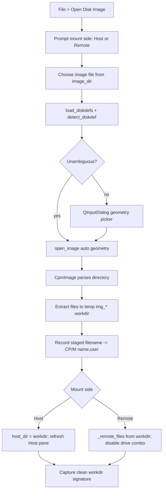
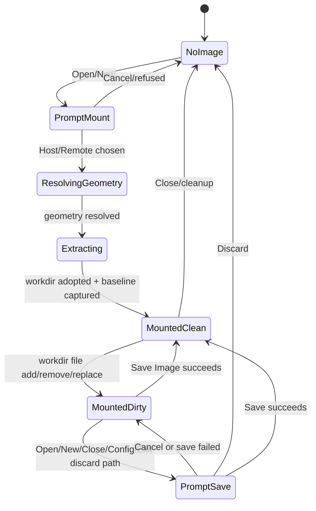

# CP/M Disk-Image Subsystem -- Design Document

**Status:** Authoritative design for `utils/disk_image/` + GUI integration
**Version:** 1 (cpm-fm v2.38)
**Author:** cpm-fm core team

This document describes the CP/M disk-image subsystem in cpm-fm. It is subordinate to
the main architecture description in [cpm_fm_architecture.md](cpm_fm_architecture.md);
that document remains authoritative for the overall layer model, threading rules, and
cross-cutting constraints. This document focuses on the disk-image feature set implemented
by `src/cpm_fm/utils/disk_image/` and its GUI integration in `src/cpm_fm/gui/mw_disk_image.py`.

Requirement scope: **FR-169 through FR-180** and **FR-185 through FR-189** are disk-image
requirements. **FR-181 through FR-184** describe the live-remote user-area subsystem and are
treated only where mounted images interact with it. Data requirements **DR-048 through DR-051**
and UI requirements **UIR-108 through UIR-120** are also relevant.

---

## 1. Overview And Scope

The disk-image subsystem lets cpm-fm open raw-sector CP/M disk images, detect or choose their
geometry, extract files into a temporary host working directory, mount that directory into either
the Host pane or Remote pane, and optionally write the working directory back into an image file.

### 1.1 Layered Split

The subsystem is intentionally split across three layers so the core is unit-testable without Qt:

| Layer | Files | Responsibility |
|---|---|---|
| **Pure disk-image core** | `utils/disk_image/__init__.py`<br>`geometry.py`, `diskdefs.py`, `directory.py`, `filesystem.py`, `image.py` | Geometry parsing, image detection, CP/M directory decoding, file reconstruction, write/repack encoding. Pure Python; no GUI imports (CR-014). |
| **GUI middleware** | `gui/mw_disk_image.py` (`_DiskImageMixin`) | File-menu handlers, temp workdir lifecycle, pane mounting, dirty-state prompting, local image-copy flows. |
| **GUI presentation** | `gui/disk_image_details_dialog.py`<br>(file-pane rendering in `gui/mw_file_panes.py`) | Read-only image metadata dialog; user-area display and filtering. |

Integrating modules: `app.py`, `mw_config.py`, `mw_transfer_batches.py`, `mw_backup_restore.py`,
`mw_remote.py`, `mw_transfers.py`. These handle menu wiring, settings persistence, transfer routing,
and backup/restore interaction but contain no disk-image logic themselves.

### 1.2 Core Architectural Decision

An opened image is presented as a **normal host directory** for most user workflows. This keeps
existing copy-to-remote/host code paths, drag-and-drop, conflict resolution, and filename
validation reusable rather than requiring a second transfer engine. The only difference is that when
the Remote pane holds a mounted image, these operations become **local filesystem copies** on the GUI
thread instead of serial X-Modem transfers over `pyserial`.

---

## 2. Open/Read Flow



### 2.1 Geometry Detection

`load_diskdefs(path=None)` reads the bundled geometry database at
`utils/disk_image/data/diskdefs`, or a caller-supplied override file, and returns a
`DiskDefs` collection (name-indexed dict-like). The bundled definitions include generic CP/M floppies,
RomWBW floppy and hard-disk formats, RC2014, RomWBW ROM disks, Amstrad PCW, Epson QX-10, Royal
Alphatronic, Interak, and other classic single-slice layouts.

`detect_diskdef(path, defs)` ranks candidate geometries for a file on disk:

1. **Size matching:** A geometry qualifies if the image size equals `DiskDef.total_bytes` (single disk)
   or is an exact multiple of that size with at least two slices (multi-slice CF card image).
2. **Directory scoring:** Each qualifier is scored by `_score_directory()` on its first slice. The score
   is the fraction of 32-byte directory slots that look like valid CP/M entries:

| Slot condition | Valid? |
|---|---|
| Empty (`0xE5` user byte) | Yes |
| User byte in `0x00..0x1F`, printable 7-bit name/type, RC <= 128, all allocation pointers <= `dsm` | Yes |
| Anything else (label/timestamp byte >= 0x20, unprintable characters, out-of-range pointers) | No |

The allocation-pointer check is the key discriminator: it rejects same-size foreign or corrupt images
whose directory region holds impossible block pointers.

3. **Scoring constants:** `_MIN_SCORE = 0.60` (a candidate below this is treated as not CP/M);
   `_AMBIGUOUS_MARGIN = 0.05` (top two within this means the GUI should prompt).

4. **Sorting:** Results are sorted by descending score, then fewer slices, then larger `maxdir`.
   The final tie-break prefers the more capacious same-size layout (e.g., `wbw_hd1k` over `rc2014`)
   so auto-selection never silently truncates the directory of an otherwise-indistinguishable volume.

5. **Ambiguity:** When top two candidates score within `_AMBIGUOUS_MARGIN`, or no candidates match,
   `is_ambiguous()` returns `True` and the GUI prompts for geometry selection via inline
   `QInputDialog`.

### 2.2 Image Open And Directory Parsing

`open_image(path, diskdef=None)` reads bytes, resolves a geometry by auto-detecting or using the caller's
forced `DiskDef`/name, and constructs `CpmImage`. It returns `None` for unreadable, empty, too-small,
foreign, or otherwise unrecognizable input rather than raising into the GUI (FR-172).

`CpmImage.__init__()` stores mutable image bytes as a `bytearray`, builds a skew table from geometry,
validates that the image is large enough for offset + boot tracks + directory region, then eagerly parses
the directory. Directory bytes are read through `_read_data()`, so boot-track reservation, geometry offset,
and sector skew are consistently applied during construction.

#### 2.2.1 CP/M Directory Record Layout (32 bytes)

| Bytes | Field | Meaning |
|---|---|---|
| 0 | `user` | User byte. `0xE5` = empty/deleted; `0x00..0x1F` = in-use file entry; >= 0x20 = disk label / timestamp (skipped). |
| 1-8 | Filename base | Space-padded, 7-bit masked for text decoding. |
| 9-11 | Extension/type | Space-padded. High bits encode read-only (`0x80` on byte 9), system (`0x80` on byte 10), archive (`0x80` on byte 11). |
| 12 | `EX` | Low extent counter (bitwise AND with `extent_mask`). |
| 13 | `S1` | Unused by cpm-fm; stored for completeness. |
| 14 | `S2` | High extent / module counter. |
| 15 | `RC` | Record count for the last extent in this entry (0-128). |
| 16-31 | AL map | Allocation block pointers: sixteen 8-bit values (for dsm < 256) or eight little-endian 16-bit values (for dsm >= 256). |

`parse_directory(data, ptr16)` skips empty/non-file entries and returns `CpmDirEntry` objects. Each entry
carries:

- **`full_name`:** `NAME.EXT` (upper case, no trailing dot when the type is empty).
- **`key`:** `(user, name, ext)` -- identity shared by every extent of one logical file.
- **`extent_index`:** `s2 * 32 + ex` -- combined logical extent number used to order a file's extents.

### 2.3 File Reconstruction

`list_files(entries, geom)` groups directory entries into logical `CpmFileEntry` records:

- Size is record-granular (a multiple of 128 bytes) summed over every extent of the file.
- Attribute flags are OR-ed across extents (a file is read-only if any extent has that flag).

```python
records_in_entry = (entry.ex & geom.extent_mask) * 128 + entry.rc
size_bytes += records_in_entry * RECORD_SIZE
```

`read_file(image, entries, name, user=None)` filters matching entries by case-insensitive `NAME.EXT` and,
when supplied, user area. It sorts extents by `extent_index`, reads the used allocation blocks in order, and
truncates the output to `total_records * 128`. User-restricted reads allow two CP/M user areas to contain
the same filename without reading the wrong extent set (FR-185).

---

## 3. Write Path

### 3.1 Blank Images And Block Allocation

`create_image(diskdef)` fills `diskdef.total_bytes` with `0xE5` and returns a `CpmImage`. This produces an
empty, valid CP/M data disk; reserved/boot tracks are blank and therefore not bootable (FR-178).

`CpmImage.write_file(name, data, user=0, read_only=False, system=False, archive=False)` validates the CP/M
8.3 name with `split_83()`, erases any existing file with the same `(user, base, ext)`, calculates the record
and block counts, and allocates the lowest free data blocks:

```python
first_data_block = ceil(maxdir * DIR_ENTRY_SIZE / blocksize)
free_blocks = range(first_data_block, dsm + 1) - used_blocks
blocks = free_blocks[:nblk]  # lowest-free allocation strategy
```

### 3.2 Directory Record Encoding

`build_dir_entries()` inverts the read path. It splits a file's block list and record count across as many
32-byte directory records as needed. Per-entry capacity:

```
records_per_entry = extents_per_entry * 128   (e.g., 128 for 16-bit-pointer geometries)
ptrs_per_entry    = 8 if ptr16 else 16
```

Each encoded record writes:

```
user | base[8] | ext[3 with R/S/A high bits] | EX | S1=0 | S2 | RC | AL[16 bytes]
```

For 16-bit geometries, allocation pointers are little-endian `uint16`; otherwise they are one byte each.
Empty files still produce a single zero-length directory entry.

### 3.3 Delete, Save, And Errors

`CpmImage.delete_file(name)` marks matching directory slots as `0xE5` (CP/M `ERA` semantics). Data bytes
are not wiped; released blocks become available for later writes.

`CpmImage.save(path)` writes the current image byte buffer to the supplied path. The `CpmImage` object does
not retain its source path, so GUI save behavior is owned by `_DiskImageMixin`.

Write failures surface as typed exceptions:

| Exception | Meaning |
|---|---|
| `InvalidNameError` | Host filename cannot be represented as CP/M 8.3. |
| `DiskFullError` | Not enough free allocation blocks for the file. |
| `DirectoryFullError` | Not enough free directory slots (maxdir exhausted). |

None of these silently truncate data. The GUI catches them and shows an error dialog.

---

## 4. Geometry Database

### 4.1 DiskDef Model

`DiskDef` mirrors cpmtools `diskdefs` stanzas:

| Field | Type | Meaning |
|---|---|---|
| `name` | `str` | Diskdef stanza name. |
| `seclen` | `int` | Physical sector length in bytes. |
| `tracks` | `int` | Total tracks. |
| `sectrk` | `int` | Sectors per track. |
| `blocksize` | `int` | CP/M allocation block size (bytes). |
| `maxdir` | `int` | Maximum directory entries. |
| `skew` | `int` | Sector skew/interleave step. |
| `boottrk` | `int` | Reserved tracks before the CP/M data area. |
| `os` | `str` | cpmtools OS label, default `"2.2"`. |
| `offset` | `int` | Byte offset before the described image slice (multi-slice support). |
| `libdsk_format` | `str` | Tolerated cpmtools/libdsk metadata (unused in cpm-fm). |
| `skewtab` | `tuple[int, ...]` | Pre-computed skew table (parsed but not currently used; numeric `skew` drives mapping). |

### 4.2 Computed Properties

```
total_bytes       = tracks * sectrk * seclen + offset
records_per_block = blocksize / 128
sectors_per_block = blocksize / seclen
data_tracks       = tracks - boottrk
dsm               = (data_tracks * sectrk * seclen) / blocksize - 1
ptr16             = dsm >= 256
ptrs_per_entry    = 8 if ptr16 else 16
extents_per_entry = max(1, ptrs_per_entry * blocksize / 16384)
extent_mask       = extents_per_entry - 1
```

`DiskDef` is immutable (`@dataclass(frozen=True)`).

### 4.3 DiskDef Parsing

`parse_diskdefs()` accepts `diskdef <name>` ... `end` stanzas, ignores comments and blank lines, requires
`seclen`, `tracks`, `sectrk`, `blocksize`, and `maxdir`, and tolerates unknown fields. The `offset` field
supports bare bytes and suffixes: `K` (x1024), `M` (x1048576), `T` (tracks), `S` (sectors).

Missing required fields or unterminated stanzas raise `DiskDefError`.

### 4.4 Bundled Geometry Definitions

The bundled `data/diskdefs` database includes 25+ geometries:

| Name | Total Size | Key Properties |
|---|---|---|
| `ibm-3740` | 250 KiB | 128 B sectors, 77 tracks, 26 sectrk, skew 6, boottrk 2 |
| `osborne1` | 100 KiB | 256 B sectors, 40 tracks, 10 sectrk, skew 2, boottrk 3 |
| `kaypro2` | 200 KiB | 512 B sectors, 40 tracks, 10 sectrk, skew 0, boottrk 1 |
| `pcw` (180K) | 180 KiB | Amstrad PCW DSDD |
| `epsqx10` | 400 KiB | Epson QX-10 |
| `alpha` | 320 KiB | Royal Alphatronic |
| `interak` | 800 KiB | Interak DSDD |
| `wbw_fd144` | 1.44 MiB | RomWBW floppy, 512 B sectors, 160 tracks, 18 sectrk |
| `wbw_fd120` | 1.20 MiB | RomWBW floppy, -3 tracks from fd144 |
| `wbw_fd720` | 720 KiB | RomWBW floppy, 9 sectrk |
| `wbw_fd360` | 360 KiB | RomWBW floppy, 80 tracks, 9 sectrk |
| `wbw_hd1k` | ~8 MiB | RomWBW hard disk, 4096 B blocks, 16-bit pointers |
| `wbw_hd512` | ~8.13 MiB | RomWBW legacy HD, 512 dir entries, 16 boot tracks |
| `rc2014` | 8 MiB | RC2014 CF (multi-slice; cpm-fm opens slice 0) |
| `wbw_rom*` | 128-896 KiB | RomWBW ROM disk images (128/256/384/896 KiB) |
| `4mb-hd` | 4 MiB | Generic HD, 128 B sectors |

The bundled database contains 19 stanzas.

### 4.5 Sector Skew Table

`build_skew_table(sectrk, skew)` constructs a logical-to-physical sector permutation. Skew 0 or 1 is
identity (common for raw/CF images). Larger values step modulo `sectrk`, skipping already-assigned physical
sectors. The same table applies to every track.

---

## 5. GUI Layer

### 5.1 Menu Actions (`app.py:setup_menu()`)

| Action | Handler | Requirements |
|---|---|---|
| Open Disk Image... | `menu_open_image()` | UIR-108, FR-169 |
| New Disk Image... | `menu_new_image()` | UIR-114, FR-178 |
| Image Details... | `menu_image_details()` | UIR-109, FR-173 |
| Save Image... | `menu_save_image()` | UIR-110, FR-174 |
| Close Disk Image... | `menu_close_image()` | UIR-113, FR-177 |

All are enabled in the File menu regardless of connection state. The only state-dependent actions are:
`Close Disk Image...` is greyed out when no image is open; `Save Image...` and `Image Details...` are
enabled only while an image is open.

### 5.2 Open Disk Image (`menu_open_image`)

The flow is:

1. **Unsaved guard:** `_maybe_prompt_save_image()` on a previous open image (FR-175).
2. **Mount-side prompt:** `_prompt_mount_side()` -- user chooses Host or Remote (default Host, UIR-112).
3. **File picker:** `QFileDialog.getOpenFileName()` browsed from `image_dir` (FR-179).
4. **Geometry resolution:** Auto-detect via `detect_diskdef()`, or prompt if ambiguous; the user may also
   force a geometry name via `QInputDialog`.
5. **Image open:** `open_image(path, diskdef)` -- parses directory eagerly.
6. **Extract files:** `_extract_files(img, workdir)` extracts every file to a temp working directory, using
   `CpmImage.read_file()` scoped to each file's user area (FR-185).
7. **Stage mapping:** `_image_stage_map[host_filename] = (cpm_name, user_area)` tracks the CP/M identity
   of each staged file. When files from multiple user areas share a name, disambiguated host filenames are
   used (`FOO~3.COM`).
8. **Mount:** Host-mounted images set `host_dir` to the workdir and refresh the Host pane. Remote-mounted
   images list files locally from the workdir, disable the drive combo, and update the Remote pane title.

### 5.3 Close Disk Image (`menu_close_image`)

1. **Unsaved guard:** `_maybe_prompt_save_image()` before discarding (FR-175).
2. **Restore directory:** Host-side close restores `_pre_image_host_dir`.
3. **Cleanup:** `_cleanup_image_workdir()` removes the temp workdir via `shutil.rmtree()`, resets all
   image state variables to "no image open", re-enables the drive combo, disables image menu actions, and
   clears the Remote list if the image had been Remote-mounted.

### 5.4 Save Disk Image (`menu_save_image`)

1. If the image has a source path (opened from file), save overwrites in place. Otherwise, a Save-As dialog
   is shown for unnamed/new images.
2. `_repack_workdir(dest_path)` writes back: re-opens the source image (or creates blank via `create_image()`),
   erases all current directory entries, iterates regular files in the workdir, maps staged names back to CP/M
   name + user area via `_image_stage_map`, calls `CpmImage.write_file(...)` for each, and saves to the
   destination path. Boot tracks are preserved verbatim when a source image is re-opened (DR-050).
3. Clean signature is captured; `image_dir` is updated to the file's directory.

### 5.5 New Disk Image (`menu_new_image`)

1. Prompt for geometry via `_prompt_new_geometry()` (list of bundled names from `QInputDialog`).
2. Prompt for mount side.
3. Create a blank image with `create_image(diskdef)`.
4. Mount in the chosen pane. The source is `None` until first save; the group title shows "(new image)".

### 5.6 Image Details Dialog (`DiskImageDetailsDialog`)

A modal read-only `QTableWidget` showing:

| Column | Content |
|---|---|
| Name | `NAME.EXT` (upper case) |
| Size | File size in bytes |
| User | CP/M user area number |
| Attrs | Compact R/S/A flags (`R` = read-only, `S` = system, `A` = archive, `-` = unset) |

Metadata is captured at open time via `_image_files` so it survives the extraction of files to plain host
files (FR-173).

### 5.7 Mount-Side Switching

- **Host mount:** `host_dir` becomes the temp workdir; prior real host directory stored in `_pre_image_host_dir`.
- **Remote mount:** Drive combo is disabled; file list populated from local workdir via `_list_image_remote()`;
  Remote pane title shows the image filename. Mutually exclusive with live serial sessions (connect is
  refused while a Remote-mounted image is active).

### 5.8 Dirty-State Management

Dirty state tracks whether the working directory differs from what was extracted or last saved:

1. `_capture_image_baseline()` records a set of `(filename, size, mtime_ns)` tuples for every regular file
   in the workdir after open, new, and successful save.
2. `_workdir_signature()` computes the current state identically.
3. `_image_is_dirty()` compares the two sets.

Before any action that would discard the working directory (open new image, New Config, load config, host-dir
change, close, exit), `_maybe_prompt_save_image()` either proceeds silently when clean, or shows a **Save /
Discard / Cancel** modal prompt (FR-175). Choosing Save calls `menu_save_image()` and allows the caller to
proceed only if saving succeeds.

---

## 6. User-Area Support for Disk Images

### 6.1 Extraction and Mapping

When extracting an image, each file's CP/M user number is preserved in `_image_stage_map`:

```python
self._image_stage_map[staged_host_name] = (cpm_name, entry.user)
```

If the same filename appears in multiple user areas, `_unique_staged_name()` keeps the first extraction as
`FOO.COM` and disambiguates later areas as `FOO~3.COM`. The stored mapping preserves the real CP/M name and
area even when the staged host filename changes.

### 6.2 User-Area Display (UIR-119)

The file-pane rendering adds a user-area prefix to visible labels: `U3  GAME.COM`. The real staged filename
remains in the item's `UserRole`, so selection, drag/drop, and transfer code use the correct host path.

### 6.3 User-Area Filter (UIR-120, FR-189)

A per-pane user-area filter drop-down appears when an image is mounted in that pane:

- Contains **All** plus each sorted, deduplicated user area present in the image.
- Hides itself when no image is mounted in the pane (FR-189).
- Narrowing the listing to one area is transient state -- reset on each mount, not persisted with per-pane
  filter/sort settings (FR-134).

### 6.4 Copy-Into-Image (`_copy_host_to_image`)

Files copied into a Remote-mounted image are validated via CP/M 8.3 name rules and conflict resolution (same
GUI dialogs as serial transfers, but running on the local GUI thread). The file is placed in the workdir at
the selected user area (FR-186).

### 6.5 Copy-Out of Image (`_copy_image_to_host`)

Selected image files are copied out to the host directory via `CpmImage.read_file()` scoped to each file's
user area. Standard file-conflict resolution applies on the destination (no CP/M 8.3 validation on output).

### 6.6 Image-to-Remote Transfer (FR-188)

When copying from a Host-mounted image to the live remote:

- `_host_image_entry(staged_name)` returns `(cpm_name, user_area)` from the stage map.
- In default `"match"` mode, the transfer sends the file under its real CP/M name into its source user area.
- The `"selected"` config mode (`image_area_mode`) overrides to use the selected remote user area instead.

This is where disk-image user areas meet the live-remote user-area subsystem (FR-183).

---

## 7. Backup and Restore on Images

### 7.1 Local Mirror Operations (FR-180)

When the Remote pane holds a mounted image, Backup and Restore become **local bulk copies** instead of serial
X-Modem operations:

| Operation | Image path behavior | Host-drive path behavior |
|---|---|---|
| **Backup** (remote -> host) | Local copy of every image file to the host directory. Wipes host dir first (destructive confirmation required, FR-152). | Runs worker thread; X-Modem download of remote drive files. |
| **Restore** (host -> remote) | Local copy of every host file into the image workdir. Wipes image workdir first (destructive confirmation required, FR-152). 8.3 validation applied to host filenames. | Runs worker thread; X-Modem upload of host files to remote drive. |

### 7.2 Image Backup (`_backup_image_to_host`)

1. Destructive confirmation (FR-152/UIR-088).
2. Wipe all regular files in the host directory (_wipe_host_dir preserves subdirectories, FR-153).
3. Copy every file from the image to the host directory via `_copy_image_to_host()`.

### 7.3 Image Restore (`_restore_host_to_image`)

1. Destructive confirmation (FR-152/UIR-088).
2. Wipe all files in the image workdir.
3. Copy every regular file from the host directory into the image via `_copy_host_to_image()` with CP/M 8.3
   name validation.

---

## 8. Configuration and Persistence

### 8.1 Image Directory (FR-179, UIR-115)

The disk-image directory is tracked separately from the host directory:

- Persisted as `image_directory` in the config JSON.
- Default value is `""` (falls back to the host directory).
- Shown as a General Config field (UIR-115).
- Used as the browse root for Open/New/Save Image dialogs.

### 8.2 State Variables (`app.py`)

| Variable | Type | Purpose |
|---|---|---|
| `_image_workdir` | `str \| None` | Temp working directory of open image |
| `_image_source` | `str \| None` | Source image file path (None for new images) |
| `_image_geom` | `DiskDef \| None` | Geometry of the open image |
| `_image_files` | `list[CpmFileEntry]` | File metadata captured at open time |
| `_image_stage_map` | `dict[str, tuple[str, int]]` | Staged name -> (CP/M name, user area) |
| `_image_baseline` | `set[tuple[str,int,int]] \| None` | Dirty-detection baseline signature |
| `_image_pane` | `str` | "host" or "remote" mount target |
| `_pre_image_host_dir` | `str \| None` | Directory before Host-side image was opened |
| `image_dir` | `str` | Folder for disk-image file operations (FR-179) |

---

## 9. State Machine



---

## 10. Threading Model

The pure disk-image core is synchronous and GUI-free. Opening, extracting, local copying, and saving disk
images run on the **GUI thread** in the current implementation. This is consistent with CR-014 because the
core has no Qt dependency, but these operations are not currently dispatched to a worker thread.

Serial Backup/Restore still uses worker threads in their existing subsystems. Local Remote-mounted image
copy/backup/restore explicitly bypasses serial I/O and runs on the GUI thread. GUI prompts used by these
local image paths are constructed directly on the GUI thread; worker-thread transfer prompts remain in the
existing signal-marshalled transfer infrastructure (NFR-001/NFR-004).

The CR-014 boundary was verified from imports: files under `utils/disk_image/` import standard library modules
and sibling disk-image modules only. All Qt imports occur in `gui/` files.

---

## 11. Temporary Workdir Lifecycle

Images are extracted to temp directories created by `make_temp_dir("img_")`, producing paths matching the
pattern `cpm_fm_img_*`. Cleanup is critical to avoid leaks:

| Trigger | Method |
|---|---|
| Open a new image (replaces previous) | `_cleanup_image_workdir()` |
| Close Disk Image | `_cleanup_image_workdir()` + unsaved guard |
| Load/New config | `_cleanup_image_workdir()` (FR-171) |
| Change host directory | `_cleanup_image_workdir()` for Host-mounted images only; Remote-mounted images are preserved (v2.35+) |
| Application exit (`closeEvent`) | `_cleanup_image_workdir()` + `sweep_temp_dirs()` |
| Application start (`main`) | `sweep_temp_dirs()` (cleans any orphaned `cpm_fm_*` dirs) |

---

## 12. Data Models and Structures

### 12.1 CpmDirEntry (internal filesystem model)

```python
@dataclass
class CpmDirEntry:
    user: int
    name: str        # 1-8 chars, trailing spaces stripped
    ext: str         # 0-3 chars, trailing spaces stripped
    ex: int          # extent counter low
    s1: int
    s2: int          # extent counter high (module)
    rc: int          # record count for the last extent in this entry
    al: list[int]    # allocation block pointers (16-bit values already combined)
    read_only: bool
    system: bool
    archive: bool
```

This is an internal filesystem model, not the file list shown directly to the GUI.

### 12.2 CpmFileEntry (presentation model)

```python
@dataclass
class CpmFileEntry:
    name: str         # "NAME.EXT", upper case
    size_bytes: int
    user: int
    read_only: bool
    system: bool
    archive: bool
```

This is the logical file model returned to callers and shown by the image details dialog.

### 12.3 ImageWriteError Hierarchy

| Exception | Meaning |
|---|---|
| `ImageWriteError` (base) | Base class for write-path failures (FR-174). |
| `DiskFullError` | The file set needs more data blocks than the geometry provides. |
| `DirectoryFullError` | More files than `maxdir` slots allows. |
| `InvalidNameError` | A name is not a valid CP/M 8.3 filename (FR-174). |

### 12.4 DetectResult (detection intermediate)

```python
@dataclass
class DetectResult:
    diskdef: DiskDef   # Geometry candidate
    score: float       # Directory-validity ratio in 0.0-1.0
    slices: int        # 1 for single disk; >1 for multi-slice CF image
```

---

## 13. Cross-Subsystem Integration Matrix

| Subsystem | Integration Point | Behavior |
|---|---|---|
| `app.py` | State fields (line 239-275), menu wiring | Owns all disk-image state variables. Group titles show image source/unsaved image names. `closeEvent()` calls cleanup after save/discard checks. |
| `mw_config.py` | `_cleanup_image_workdir()`, `image_dir` config field | Loading/newing configuration discards open images through the same dirty guard and cleanup path. General config persists/updates `image_directory` independently from `host_directory` (FR-179). |
| `config_dialogs.py` | General Config dialog | Exposes the Default Image Directory field (UIR-115). |
| `mw_file_panes.py` | File-pane rendering + area filter | Host/Remote pane rendering adds user-area prefixes and filter combos for mounted images. Host directory changes discard only Host-mounted images; Remote-mounted images remain mounted (v2.35+). |
| `mw_transfer_batches.py` | Copy to remote/host routing | If Remote pane is image-mounted, Copy to Remote/Host route to local copy helpers instead of serial X-Modem. If Host pane is image-mounted, Copy to Remote can preserve the file's source CP/M name/user area (FR-188). |
| `mw_transfers.py` | Drag-and-drop handling | Uses the same local helpers when the Remote pane is image-mounted. |
| `mw_backup_restore.py` | Backup/Restore dispatch | When Remote pane holds an image, Backup/Restore become local mirror operations using `_copy_image_to_host()` and `_copy_host_to_image()` (FR-180). Serial paths remain threaded. |
| `mw_remote.py` | Refresh/change-user-area/connect | Refresh and change-user-area re-list a Remote-mounted image locally without serial I/O. Connect is refused while a Remote-mounted image is active (`_remote_is_image()` check). |
| `terminal/cpm_parser.py` | User-area tracking (`drive_prompt_user`) | Belongs to the live-remote user-area subsystem (DR-051), but its tracked user area affects image-to-remote transfer behavior and Remote-mounted image filtering/copy-in defaults. |

---

## 14. Testing Strategy

### 14.1 Core Unit Tests (`tests/test_disk_image/`)

| Test file | Focus | Requirements verified |
|---|---|---|
| `test_diskdefs.py` (8 tests) | cpmtools parsing, bundled definitions, offset suffixes, malformed stanzas | DR-048, FR-170 |
| `test_geometry.py` (4 tests) | Skew table identity/permutation, known IBM-3740 sequence, pointer width, extent mask | DR-049 |
| `test_detect.py` (6 tests) | Geometry ranking, ambiguity logic, foreign/zero-byte rejection, allocation-pointer scoring | FR-170, FR-172 |
| `test_directory.py` (6 tests) | Listing, reading, multi-extent files, record-tail truncation, attributes, 16-bit pointers | FR-169, FR-171, DR-049 |
| `test_image.py` (4 tests) | `open_image()` auto/forced geometry and bad input rejection | FR-169, FR-170, FR-172 |
| `test_write.py` (13 tests) | Write/read round trips, user areas, multi-extent writes, boot-track preservation, delete/reuse, disk/directory full, invalid names | FR-174, DR-050, FR-178 |

The fixture `make_image_fn` in `conftest.py` is a synthetic image builder ("mini mkfs") that creates
raw byte-images for a chosen `DiskDef`, independently deriving geometry maths (skew, tracks, sector
layout). It cross-validates the reader by writing known-good data.

### 14.2 GUI Smoke Tests (`tests/test_gui_smoke.py`)

~30 disk-image tests covering: open/extract/list, bad-file rejection, cleanup on close, Image Details
dialog rendering and action enablement, load config discards, change dir discards, save image overwrite,
received files included in save, unsaved-changes routing (Save/Discard/Cancel), dirty-state management,
host vs. remote mount behavior, copy-to-image staging, new disk image creation, new image save adoption,
image directory persistence, local backup/restore on images.

### 14.3 User-Area Tests (`tests/test_user_area.py`)

Tests area extraction preservation and disambiguation, pane area map gating, area prefix rendering,
copy-to-Remote match/selected modes, area filter visibility/population/narrowing, open image stage-map
survival through cleanup cycles.

### 14.4 Backup/Restore Tests (`tests/test_backup_restore.py`)

13 tests covering backup/restore orchestration order, cancel behavior, empty-source handling, host-dir
wipe (preserving subdirectories), remote-drive wipe (per-file and erase-all macro), connection guards,
and confirmation dialog button order.

### 14.5 Integration/HIL Tests (`integration/test_gui_backup_restore.py`)

3 destructive integration tests requiring real CP/M hardware: restore wipes scratch + uploads, restore with
erase-all macro, backup downloads remote to host. Double-gated by `--run-destructive` and a `scratch_drive`
that differs from the live connect drive.

---

## 15. Requirements Traceability

| Requirement | Main Implementation Evidence | Test Evidence |
|---|---|---|
| **FR-169** | `mw_disk_image.py:menu_open_image`, `utils/disk_image.open_image`, `filesystem.list_files` | `test_disk_image/test_image.py`, `test_gui_smoke.py:test_open_disk_image_extracts_and_lists` |
| **FR-170** | `detect_diskdef`, `load_diskdefs`, `parse_diskdefs`, `_resolve_geometry` | `test_disk_image/test_detect.py`, `test_disk_image/test_diskdefs.py` |
| **FR-171** | `_extract_files`, `_cleanup_image_workdir`, `filesystem.read_file` | `test_disk_image/test_directory.py`, GUI cleanup/open tests |
| **FR-172** | `open_image`, `CpmImage.__init__`, extraction failure handling | `test_disk_image/test_image.py`, `test_gui_smoke.py:test_open_disk_image_rejects_bad_file` |
| **FR-173** | `menu_image_details`, `DiskImageDetailsDialog` | `test_gui_smoke.py` image-details tests |
| **FR-174** | `menu_save_image`, `_repack_workdir`, `CpmImage.write_file/delete_file/save`, `build_dir_entries`, `split_83` | `test_disk_image/test_write.py`, save-image GUI tests |
| **FR-175** | `_maybe_prompt_save_image`, `_prompt_save_discard_cancel`, `_image_is_dirty`, `_capture_image_baseline` | dirty/open/close/save GUI tests |
| **FR-176** | `_prompt_mount_side`, `_remote_is_image`, `_list_image_remote`, local copy helpers, transfer routing | Remote-mount GUI tests |
| **FR-177** | `menu_close_image`, `_cleanup_image_workdir`, File menu action setup | Close-image GUI tests |
| **FR-178** | `menu_new_image`, `_prompt_new_geometry`, `create_image` | `test_disk_image/test_write.py`, new-image GUI tests |
| **FR-179** | `image_dir`, open/save browse roots, config persistence | `test_gui_smoke.py:test_image_directory_tracked_and_persisted` |
| **FR-180** | `_backup_image_to_host`, `_restore_host_to_image` | backup/restore image GUI tests |
| **FR-185** | `_extract_files`, `_unique_staged_name`, `read_file(user=...)` | `test_user_area.py`, `test_disk_image/test_write.py` |
| **FR-186** | `_copy_host_to_image`, `_pane_area_map`, image-sourced remote/user-area rendering | `test_user_area.py` pane map tests |
| **FR-187** | `_repack_workdir`, `CpmImage.write_file(user=...)` | `test_disk_image/test_write.py` |
| **FR-188** | `_host_image_entry`, transfer-to-remote batch area selection | `test_user_area.py` image-to-remote tests |
| **FR-189** | `_update_area_filter`, `_render_file_list`, pane apply methods | `test_user_area.py` area-filter tests |
| **DR-048** | `DiskDef`, `parse_diskdefs`, bundled `data/diskdefs` | `test_disk_image/test_diskdefs.py`, `test_geometry.py` |
| **DR-049** | `parse_directory`, `CpmDirEntry`, `build_skew_table`, `read_file` | `test_disk_image/test_directory.py`, `test_geometry.py` |
| **DR-050** | `build_dir_entries`, `CpmImage.write_file/delete_file/save/_write_data` | `test_disk_image/test_write.py` |
| **DR-051** | `CPMParser.drive_prompt_user` (live remote user area) | `test_cpm_parser.py` drive-prompt tests |
| **UIR-108-115** | File menu actions, dialogs, image directory config | `test_gui_smoke.py` disk-image UI tests |
| **UIR-119-120** | Area prefixes and per-pane area filters | `test_user_area.py`, `test_gui_smoke.py` |

UIR-116 through UIR-118 are adjacent UI requirements. UIR-116/117 describe configuration dialogs outside
the disk-image subsystem except for the image directory field (UIR-115). UIR-118 is the live Remote Files
user-area combo; Remote-mounted images reuse its selected value for local filtering/copy-in behavior, but
the serial command aspect belongs to FR-181 through FR-184.

---

## 16. Version History of Disk-Image Features

| Version | Feature Summary |
|---|---|
| **2.28** | CP/M disk image -- initial open/extract/list/save/close support. Host-side mount only. |
| **2.30** | Save Image improvements (overwrite in place for named images). |
| **2.32** | Dual-pane mount (host and Remote) + local host-to-image copy (FR-176). Backup/Restore for remote drives unchanged (serial). |
| **2.33** | File > Close Disk Image... action added (FR-177). |
| **2.33.1** | Bug fix: Remote-side mount after Host-side no longer leaves stale Host pane path. |
| **2.34** | New empty disk image creation (File > New Disk Image...) -- FR-178. |
| **2.35** | Major UX overhaul: (1) host-dir change does not disturb Remote-mounted images; (2) separate image directory setting (FR-179, UIR-115); (3) KISS save (no opt-in write gate); (4) Backup/Restore to images as local bulk copies (FR-180). |
| **2.37** | CP/M user-area (0-15) support across live remote and disk images: FR-181 through FR-189, resolving GitHub issues #7/#8. Area-preserved extraction, area-aware transfer to remote, per-pane area filter drop-down. |
| **2.38** | Current version; this document is authored for the 2.38 state of the subsystem. |

---

## 17. Future Extensions (Out of Scope)

| Area | Current State | Potential Direction |
|---|---|---|
| Multi-slice CF selection | Detection recognizes multi-slice-sized files, but `open_image()` reads only the first geometry-sized slice. RC2014 bundled comment notes cpm-fm opens slice 0. | Slice selector dialog when detection finds > 1 candidate with slices > 1. |
| `skewtab` use | The parser stores `skewtab`, but sector mapping is built from numeric `skew`. | Prefer `skewtab` over computed skew when present in the diskdef stanza. |
| Long filename support | The write path intentionally validates CP/M 8.3 names only. | LFN/short-name pair encoding (requires a different directory format). |
| Async image open/save | Disk-image open/save/local copy paths are synchronous GUI-thread operations today. | Dispatch heavy I/O to worker threads with Qt signals for progress UI updates. |
| Rich image mutation UI | Image edits are mediated through the mounted workdir and ordinary copy/delete workflows rather than an image-native file manager. | Dedicated image editor dialog with inline block allocation visualization. |
| Additional image formats | All images are treated as raw-sector dumps; no format-specific handling (D88, HDM, HDI, IMG extensions are all opaque). | Format-aware readers that strip headers/trailers or handle multi-disk containers. |

---

## 18. Appendix: File Inventory

### 18.1 Core Package (`src/cpm_fm/utils/disk_image/`)

| File | Lines | Key Classes / Functions |
|---|---|---|
| `__init__.py` | 248 | `load_diskdefs()`, `detect_diskdef()`, `is_ambiguous()`, `open_image()`, `create_image()`, `DiskDefs`, `DetectResult` |
| `geometry.py` | 113 | `DiskDef` (dataclass), `build_skew_table()` |
| `diskdefs.py` | 162 | `parse_diskdefs()`, `DiskDefError` |
| `directory.py` | 96 | `CpmDirEntry`, `parse_directory()`, constants (`DIR_ENTRY_SIZE`, `EMPTY_USER`, `MAX_USER`) |
| `filesystem.py` | 221 | `CpmFileEntry`, `list_files()`, `read_file()`, `split_83()`, `build_dir_entries()`, `ImageWriteError` hierarchy |
| `image.py` | 264 | `CpmImage` (skew-aware sector I/O, directory parsing, read/write/save) |
| `data/diskdefs` | 259 | Bundled geometry definitions (19 stanzas) |

### 18.2 GUI Files (`src/cpm_fm/gui/`)

| File | Lines | Key Classes / Methods |
|---|---|---|
| `mw_disk_image.py` | 885 | `_DiskImageMixin` -- all disk-image menu handlers, workdir lifecycle, dirty-state, local copy flows |
| `disk_image_details_dialog.py` | 100 | `DiskImageDetailsDialog` |
| `mw_backup_restore.py` | 356 | `_BackupRestoreMixin.do_backup/do_restore` image branches (`_backup_image_to_host`, `_restore_host_to_image`) |
| `mw_config.py` | 431 | Config save/load with `image_dir`, `_cleanup_image_workdir()` calls |
| `mw_remote.py` | 787 | `_remote_is_image()` guards in connect, refresh, drive change, user-area change |
| `mw_transfer_batches.py` | 486 | Image-aware copy-to-remote/host routing (`_host_image_entry`, FR-188 staging) |
| `mw_file_panes.py` | (various) | Area prefix rendering, per-pane area filter combo |

### 18.3 Application Entry Point (`src/cpm_fm/app.py`)

| Section | Lines | Content |
|---|---|---|
| Image state variables | 233-275 | `_image_workdir`, `_image_source`, `_image_geom`, `_image_files`, `_image_stage_map`, `_image_baseline`, `_image_pane`, `_pre_image_host_dir`, `image_dir` |
| Menu wiring | 555-578 | File menu actions for Open/New/Details/Save/Close Disk Image |
| Toolbar wiring | 679-680 | Backup/Restore toolbar buttons (shared with drive operations) |
| Group title updates | 468 | Remote pane title shows image filename when mounted; Host pane title shows image source or "(new image)" |
