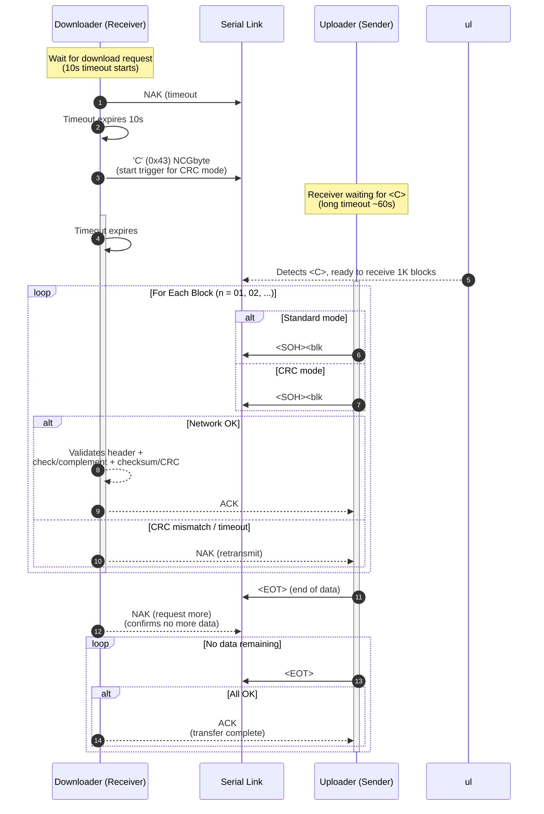
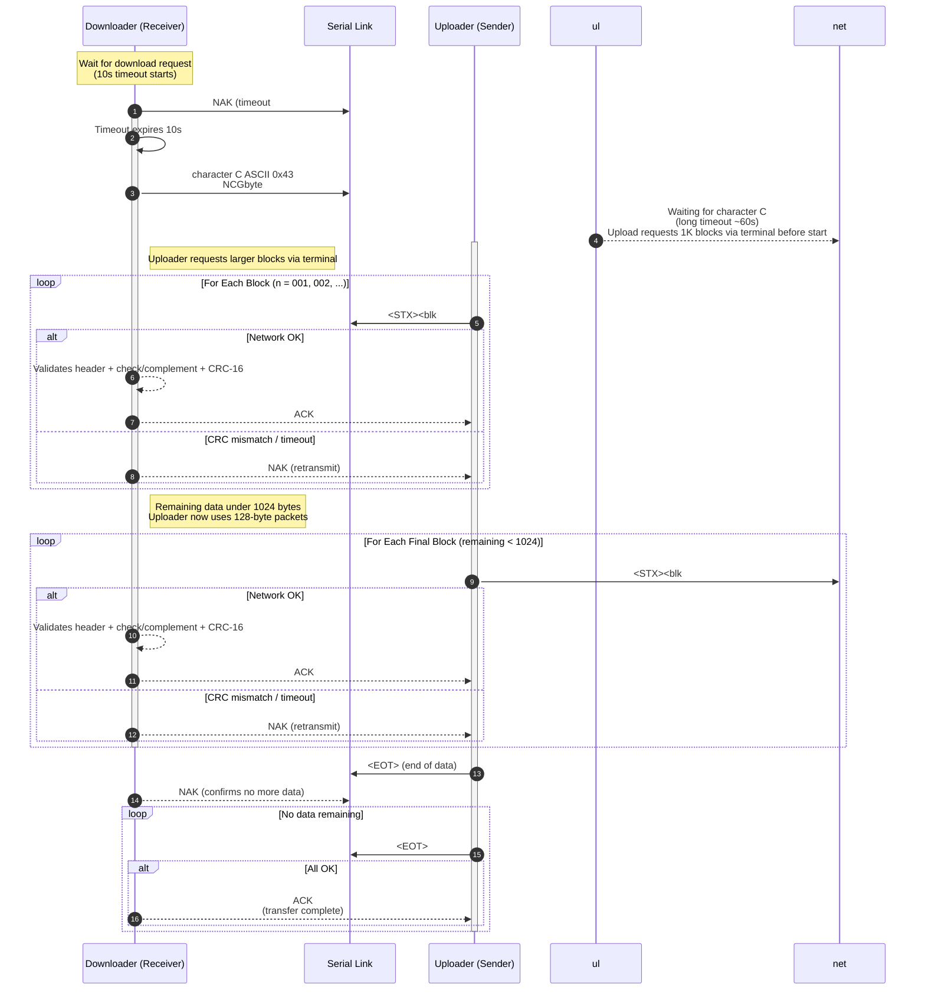

# X-Modem Protocol Specifications (Synthesis)

## Overview
The X-Modem protocol family is a widely adopted method for binary and text file transfers over asynchronous serial links. It supports several variants, including the original checksum-based version, the CRC-protected version, and the high-speed 1K version.

## Common Definitions

### Control Characters
| Character | Hex | Description |
| :--- | :--- | :--- |
| `<SOH>` | `01H` | Start of Header (used in Standard/CRC) |
| `<STX>` | `02H` | Start of Text (used in 1K) |
| `<EOT>` | `04H` | End of Transmission |
| `<ACK>` | `06H` | Acknowledge |
| `<NAK>` | `15H` | Negative Acknowledge |
| `<CAN>` | `18H` | Cancel Transmission |

### Transmission Medium Requirements
- **Mode:** Asynchronous, 8 data bits, no parity, one stop bit.
- **Data Content:** No restriction; can be binary, ASCII, etc.
- **CP/M Compatibility (for ASCII):**
  - Tabs: `09H` (every 8 characters).
  - Line Endings: `CR/LF` (`0DH 0AH`).
  - EOF indicator: `^Z` (`1AH`).

## Protocol Variants

### 1. X-Modem (Standard / Checksum)
The original version uses a simple 8-bit checksum for error detection.

**Packet Structure:**
`<SOH>` + `<blk #>` + `<255-blk #>` + `[128 data bytes]` + `<cksum>`
- `<SOH>`: `01H`.
- `<blk #>`: Binary block number (starts at `01`, increments, wraps `0FFH` to `00H`).
- `<255-blk #>`: One's complement of the block number (bitwise NOT operation).
- `<cksum>`: Sum of the 128 data bytes (toss any carry).

### 2. X-Modem CRC
Provides enhanced error detection using a CRC-16 checksum.

**Packet Structure:**
`<SOH>` + `<blk #>` + `<255-blk #>` + `[128 data bytes]` + `<CRC High Byte>` + `<CRC Low Byte>`
- The 1-byte checksum is replaced by a 2-byte CRC-16.
- **NCGbyte (Start Trigger):** After initial 10-second receiver timeout, the downloader sends `'C'` (`0x43`) to initiate the upload. The uploader waits for this character before beginning transmission.

**CRC Calculation:**
The CRC starts at zero for each block and is updated byte-by-byte using a lookup table:
`CRC := (oldcrc << 8) ^ crctable[(oldcrc >> 8) ^ data]`

### 3. X-Modem 1K
An optimized version for higher throughput, supporting larger block sizes.

**Packet Structure (1024-byte mode):**
`<STX>` + `<blk #>` + `<255-blk #>` + `[1024 data bytes]` + `<CRC High Byte>` + `<CRC Low Byte>`

**Packet Structure (128-byte mode, used at end of transfer):**
`<STX>` + `<blk #>` + `<255-blk #>` + `[128 data bytes]` + `<CRC High Byte>` + `<CRC Low Byte>`

**Key Features:**
- **NCGbyte (Start Trigger):** Identical to CRC version, uses `'C'` (`0x43`).
- **Efficiency:** Allows 1024-byte blocks for speed, and reverts to 128-byte blocks at the end of a transfer if the remaining data is small, avoiding excessive padding with null bytes.

## Transfer Logic & Error Recovery

### File Level Protocol
- **Retries:** All errors are typically retried up to 10 times. If the limit is reached, the program may prompt the operator or abort.
- **Completion:** The sender sends `<EOT>`. The receiver responds with `<NAK>` (to request another `<EOT>`) or `<ACK>` (to finalize).

### Sender/Receiver Considerations
- **Timeout (Receiver):** 
  - Initial timeout of 10 seconds to wait for the start signal.
  - Subsequent timeout of 1 second per character during packet reception.
- **Error Recovery:** 
  - If a block is corrupted, the receiver sends `<NAK>`, prompting a retransmission of the same block.
  - If a received block number is unexpected (not current or repeat), it indicates loss of sync; the transmission should be aborted with `<CAN>`.
- **Cancellation:** The receiver can cancel the transfer at any time by sending `<CAN>`. It is recommended to send 2 to 8 consecutive `<CAN>` bytes.

### Programming Tips
- When sending a `<NAK>`, it is good practice to "purge" the line (wait for clear) to ensure the other end sees the command.
- The sender should discard any characters in its UART buffer after completing a block transmission to prevent glitches from being misinterpreted as data.

## Sequence Diagrams

### 128-Byte Transfer (Standard / CRC)

The standard X-Modem transfer uses 128-byte blocks with either checksum (**Standard**) or CRC-16 (**CRC**) error detection. The transfer is **receiver-driven**: the downloader initiates after a timeout.

### 1K-Byte Transfer (X-Modem 1K, CRC-only)

The X-Modem 1K variant uses **STX** instead of SOH and sends **1024-byte blocks** for improved throughput. At the end of the transfer, it **falls back to 128-byte blocks** to minimize null-padding overhead when remaining data is small.

### Key Differences Between 128-Byte and 1K Transfers

| Aspect | Standard/CRC (128-byte) | X-Modem 1K |
|--------|------------------------|------------|
| **Marker** | `<SOH>` (`01H`) | `<STX>` (`02H`) |
| **Max block size** | 128 bytes | 1024 bytes (falls back to 128 at end) |
| **Blocks per transfer** | More blocks, more ACKs/NAKs | Fewer blocks, fewer round-trips |
| **CRC mode required** | No (checksum is optional) | **Yes** — CRC-16 only |
| **Efficiency gain** | Baseline | ~8x fewer headers + ~8x fewer ACKs per same data |
| **Final block handling** | May be < 128 bytes (padded with `0x1A` / Ctrl-Z) | Falls back to 128-byte mode for remainder |

